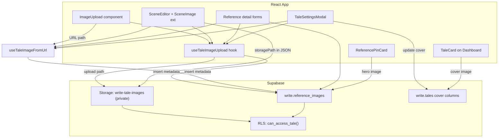
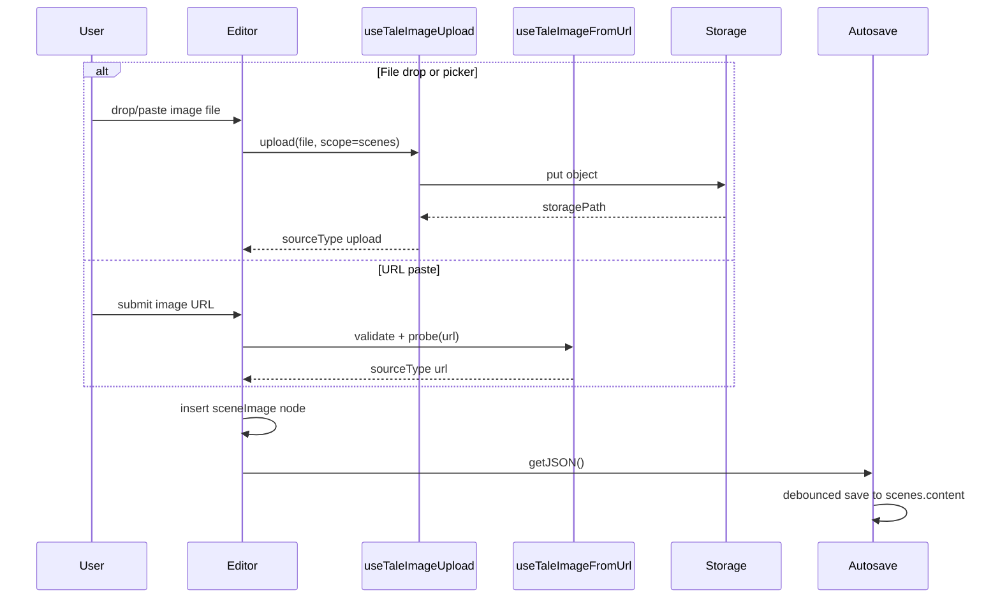
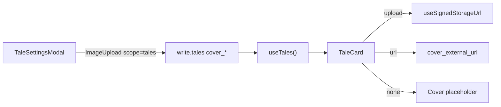

# Image Support for Write Knuckles

## Current state

- **Storage foundation (step 1 — done):** migration `011` adds private bucket `write-tale-images`, `write.can_access_tale()`, and Storage RLS. Path convention: `{user_id}/{tale_id}/{scope}/{entity_id}/{uuid}.{ext}`.
- **Upload infrastructure (step 2 — done):** `src/lib/images/*`, `useSignedStorageUrl`, `useTaleImageUpload`, `useTaleImageFromUrl`, and `ImageUpload` component. Metadata persistence (reference_images, tale cover) lands in steps 3–4.
- **TipTap** ([`src/lib/editor/extensions.js`](c:\Users\scott\Documents\code\write-knuckles\src\lib\editor\extensions.js)) has no image extension; scene content is TipTap JSON in `write.scenes.content`.
- **Reference cards** share [`ReferencePinCard.jsx`](c:\Users\scott\Documents\code\write-knuckles\src\components\research\ReferencePinCard.jsx) via Character/Location/Research list components; forms live inline in each `*List.jsx`.
- **RLS** is single-owner today (`auth.uid() = user_id` + `write.is_approved_user()`). No collaborator policies yet.

Bronze Knuckles ([`SubContext.jsx`](c:\Users\scott\Documents\code\bronze-knuckles\src\contexts\SubContext.jsx)) already uses private buckets + `createSignedUrl` — we will follow that pattern, but scope paths per tale.

---

## Architecture



### Storage path convention

All files live in a **private** bucket `write-tale-images`:

```
{user_id}/{tale_id}/{scope}/{entity_id}/{uuid}.{ext}
```

| Scope | Used for |
|-------|----------|
| `scenes` | TipTap inline images |
| `characters` | Character card gallery |
| `locations` | Location card gallery |
| `research` | Research card gallery |
| `tales` | Tale cover image (one per tale) |

Paths embed `tale_id` so Storage RLS can verify access without extra DB lookups. Filenames are UUIDs (not user-provided names) to avoid collisions and path injection.

### Access control (owner now, collaborators later)

Add a reusable SQL helper in migration `011_tale_images_storage.sql`:

```sql
write.can_access_tale(p_tale_id uuid) RETURNS boolean
-- NOW: is_approved_user() AND tale.user_id = auth.uid()
-- LATER: OR EXISTS (collaborator row) — stub comment only, no table yet
```

Use this helper in:
- **Storage policies** on `storage.objects` for bucket `write-tale-images` (SELECT/INSERT/UPDATE/DELETE)
- **`write.reference_images` RLS** (same pattern as characters/locations)

This gives one place to extend when collaborators ship.

### Image sources: upload vs URL

Images can come from two persisted source types:

| Source | Storage | Persisted reference | Display |
|--------|---------|---------------------|---------|
| **Upload** (file picker / drag-drop) | `write-tale-images` bucket | `storage_path` | Signed URL via `useSignedStorageUrl` |
| **URL** (user pastes link) | None — hotlinked | `external_url` | URL used directly |

Uploaded images stay private and tale-scoped. URL images are stored as-is (no re-hosting); the user is responsible for link longevity and CORS/hotlink policies on the host.

### Signed URLs (uploads only)

For uploaded images, store **`storage_path`** in DB / TipTap attrs — never raw signed URLs in persisted data. Resolve at display time via a shared hook:

- [`src/hooks/useSignedStorageUrl.js`](c:\Users\scott\Documents\code\write-knuckles\src\hooks\useSignedStorageUrl.js) — React Query wrapper around `supabase.storage.from('write-tale-images').createSignedUrl(path, ttl)` with ~1h TTL and auto-refresh before expiry.
- [`src/lib/images/storage.js`](c:\Users\scott\Documents\code\write-knuckles\src\lib\images\storage.js) — `buildStoragePath()`, `uploadTaleImage()`, `deleteTaleImage()`, `validateImageFile()`.
- [`src/lib/images/urls.js`](c:\Users\scott\Documents\code\write-knuckles\src\lib\images\urls.js) — `validateImageUrl()`, `probeImageUrl()` (load via `Image` to confirm reachable + image MIME).

---

## Part 1: Reusable image input (URL + upload)

### New files

| File | Purpose |
|------|---------|
| [`src/components/images/ImageUpload.jsx`](c:\Users\scott\Documents\code\write-knuckles\src\components\images\ImageUpload.jsx) | Reusable input: URL field + drop zone + file picker |
| [`src/hooks/useTaleImageUpload.js`](c:\Users\scott\Documents\code\write-knuckles\src\hooks\useTaleImageUpload.js) | File upload orchestration |
| [`src/hooks/useTaleImageFromUrl.js`](c:\Users\scott\Documents\code\write-knuckles\src\hooks\useTaleImageFromUrl.js) | URL validation + metadata insert |
| [`src/lib/images/storage.js`](c:\Users\scott\Documents\code\write-knuckles\src\lib\images\storage.js) | Path building, validation, Supabase calls |
| [`src/lib/images/urls.js`](c:\Users\scott\Documents\code\write-knuckles\src\lib\images\urls.js) | URL parsing, https-only check, image probe |
| [`src/lib/images/constants.js`](c:\Users\scott\Documents\code\write-knuckles\src\lib\images\constants.js) | `MAX_IMAGE_BYTES` (10 MB), allowed MIME types (`image/jpeg`, `image/png`, `image/webp`, `image/gif`) |

### `ImageUpload` API

```jsx
<ImageUpload
  taleId={taleId}
  scope="characters"       // scenes | characters | locations | research | tales
  entityId={character.id}  // for tales scope, pass taleId as entityId
  onAdded={(result) => …}  // { sourceType, storagePath?, externalUrl?, signedUrl?, imageId? }
  multiple={false}         // true for card galleries
  compact={false}          // toolbar vs form layout
  allowUrl={true}          // false to hide URL tab (e.g. if ever needed)
/>
```

**Three input methods in one component:**

1. **URL** — text field + "Add image" button at the top (or in a compact popover for toolbar mode). User pastes `https://…` and submits. Validates format, requires `https:`, probes load via hidden `Image()` before accepting. Shows inline error if unreachable or not an image.
2. **Drag-and-drop** — drop zone with visual active state; accepts image files only.
3. **File picker** — click the drop zone (or a "Browse" link) to open native file picker (`<input type="file" accept="image/*">`).

**Shared behavior:**
- Client validation: file type + size for uploads; https + probe for URLs.
- Progress / error / success states; disabled while uploading or probing.
- Keyboard accessible — URL field is a normal text input; drop zone has `role="button"`, Enter/Space opens picker.
- Reused everywhere — editor toolbar, reference detail forms, future surfaces.

**Compact (toolbar) variant:** image button opens a small popover with URL field on top and a mini drop zone below — same three methods, less vertical space.

### `useTaleImageUpload` flow (files)

1. Validate file
2. Build path → `upload()` to bucket
3. If scope is a reference type → insert row in `write.reference_images` with `source_type = 'upload'`
4. If scope is `tales` → update `write.tales` cover columns via `useUpdateTaleCover`
5. Return `{ sourceType: 'upload', storagePath, signedUrl, imageId? }`

### `useTaleImageFromUrl` flow (URLs)

1. `validateImageUrl(url)` — parseable, `https:` only, reasonable length cap
2. `probeImageUrl(url)` — confirm image loads (timeout ~8s); reject on failure
3. If scope is a reference type → insert row with `source_type = 'url'`, `external_url = url`
4. If scope is `tales` → update `write.tales` cover columns (`cover_source_type = 'url'`)
5. For editor scope → return `{ sourceType: 'url', externalUrl: url }` (no DB row, URL goes in TipTap JSON)
6. Return result to `onAdded` callback

---

## Part 2: Database migration

### Migration `011_tale_images_storage.sql`

- Create private bucket `write-tale-images` (`public: false`)
- Storage RLS policies keyed on `can_access_tale` parsed from path segment 2 (`tale_id`)
- Create `write.reference_images`:

```sql
write.reference_images (
  id uuid primary key default gen_random_uuid(),
  tale_id uuid not null references write.tales(id) on delete cascade,
  user_id uuid not null references auth.users(id) on delete cascade,
  entity_type text not null check (entity_type in ('character','location','research')),
  entity_id uuid not null,
  source_type text not null check (source_type in ('upload','url')),
  storage_path text,          -- set when source_type = 'upload'
  external_url text,          -- set when source_type = 'url'
  alt_text text,
  is_hero boolean not null default false,
  sort_order int not null default 0,
  created_at timestamptz default now(),
  check (
    (source_type = 'upload' and storage_path is not null and external_url is null)
    or (source_type = 'url' and external_url is not null and storage_path is null)
  )
)
```

- Partial unique index: one hero per entity — `UNIQUE (entity_type, entity_id) WHERE is_hero`
- RLS: `can_access_tale(tale_id)` for all operations
- Trigger: on hero change, sync `characters.avatar_url` from hero row — use `external_url` or a resolved upload URL (keeps existing column useful for simple queries; locations/research get no denormalized column — hero comes from join)
- Delete mutation: only call `deleteTaleImage(storage_path)` when `source_type = 'upload'`; URL rows need no storage cleanup

**Tale cover columns** on `write.tales` (same migration or `011`):

```sql
alter table write.tales
  add column cover_source_type text check (cover_source_type is null or cover_source_type in ('upload','url')),
  add column cover_storage_path text,
  add column cover_external_url text,
  add constraint tales_cover_source_check check (
    (cover_source_type is null and cover_storage_path is null and cover_external_url is null)
    or (cover_source_type = 'upload' and cover_storage_path is not null and cover_external_url is null)
    or (cover_source_type = 'url' and cover_external_url is not null and cover_storage_path is null)
  );
```

One cover per tale — stored directly on the tale row (not `reference_images`). Replacing a cover deletes the previous upload from storage if applicable.

### Migration `012_reference_images_indexes.sql` (optional, can merge into 011)

- Index on `(entity_type, entity_id, sort_order)` for gallery fetch
- Update [`010_write_knuckles_bootstrap.sql`](c:\Users\scott\Documents\code\write-knuckles\supabase\migrations\010_write_knuckles_bootstrap.sql) for fresh installs

### New hooks

- [`src/hooks/useReferenceImages.js`](c:\Users\scott\Documents\code\write-knuckles\src\hooks\useReferenceImages.js) — fetch gallery by entity, set hero, reorder, delete
- Extend [`useTaleReference.js`](c:\Users\scott\Documents\code\write-knuckles\src\hooks\useTaleReference.js) to batch-fetch heroes for all characters/locations/research (or join in a single query)

---

## Part 3: TipTap editor images

### Dependencies

Add to [`package.json`](c:\Users\scott\Documents\code\write-knuckles\package.json):
- `@tiptap/extension-image`
- `@tiptap/extension-file-handler` (paste + drop)

### Custom extension: `SceneImage`

New file [`src/lib/editor/sceneImage.js`](c:\Users\scott\Documents\code\write-knuckles\src\lib\editor\sceneImage.js) — extends Image with attrs:

| Attr | Values | Effect |
|------|--------|--------|
| `sourceType` | `upload` \| `url` | Which reference field is set |
| `storagePath` | string \| null | Upload reference (not signed URL) |
| `src` | string \| null | External URL when `sourceType = 'url'` |
| `alt` | string | Accessibility + plain-text extraction |
| `display` | `block` \| `inline` \| `float-left` \| `float-right` \| `full` | Text flow behavior |
| `width` | number \| null | Optional max width % |

Check constraint (app-level): exactly one of `storagePath` or `src` is set, matching `sourceType`.

**Display modes (CSS in [`src/index.css`](c:\Users\scott\Documents\code\write-knuckles\src\index.css)):**

- `block` — centered, max-width 100%, breaks paragraph flow (default)
- `inline` — small image inline with text (`display: inline`)
- `float-left` / `float-right` — text wraps (`float` + margin)
- `full` — edge-to-edge within editor column

Custom **NodeView** resolves the display URL:
- `sourceType = 'upload'` → `storagePath` → signed URL via `useSignedStorageUrl` (skeleton while loading)
- `sourceType = 'url'` → `src` used directly (skeleton until `onload`; show broken-image state on error)

### Wire into editor

1. Register `SceneImage` in [`extensions.js`](c:\Users\scott\Documents\code\write-knuckles\src\lib\editor\extensions.js) — also add to [`plainText.js`](c:\Users\scott\Documents\code\write-knuckles\src\lib\editor\plainText.js) extensions list with `renderText` returning `[alt]` for search indexing.
2. [`SceneEditor.jsx`](c:\Users\scott\Documents\code\write-knuckles\src\components\editor\SceneEditor.jsx) — pass `taleId` + `scene.id` into extension options; configure `FileHandler` for image paste/drop → upload → `setSceneImage`.
3. [`EditorToolbar.jsx`](c:\Users\scott\Documents\code\write-knuckles\src\components\editor\EditorToolbar.jsx) — compact `ImageUpload` popover (URL field + drop zone + picker).
4. **Bubble menu** (new [`ImageBubbleMenu.jsx`](c:\Users\scott\Documents\code\write-knuckles\src\components\editor\ImageBubbleMenu.jsx)) when image selected: display mode toggles, alt text input, replace URL (if external), delete.

### Persistence

No autosave changes — image nodes save in existing JSON pipeline ([`useAutosave.js`](c:\Users\scott\Documents\code\write-knuckles\src\hooks\useAutosave.js)). Scene images are **not** rows in `reference_images` (only in TipTap JSON + storage). Orphan cleanup can be a future background task.



---

## Part 4: Reference card image galleries

### Shared gallery component

[`src/components/images/ReferenceImageGallery.jsx`](c:\Users\scott\Documents\code\write-knuckles\src\components\images\ReferenceImageGallery.jsx):
- Thumbnail grid of existing images (signed URLs for uploads, direct URL for external)
- Small badge on thumbnail indicating source (upload vs link icon)
- `ImageUpload` with `multiple={true}` and `allowUrl={true}` — all three input methods
- "Set as hero" action per image (star/badge)
- Delete with confirm
- Drag-to-reorder (optional v1: up/down buttons; dnd-kit already in project if we want drag)

### Detail form integration

Add gallery at top of each inline form:
- [`CharacterList.jsx`](c:\Users\scott\Documents\code\write-knuckles\src\components\research\CharacterList.jsx) — `CharacterDetailForm`
- [`LocationList.jsx`](c:\Users\scott\Documents\code\write-knuckles\src\components\research\LocationList.jsx) — `LocationDetailForm`
- [`ResearchList.jsx`](c:\Users\scott\Documents\code\write-knuckles\src\components\research\ResearchList.jsx) — `ResearchDetailForm`

### Card display

Extend [`ReferencePinCard.jsx`](c:\Users\scott\Documents\code\write-knuckles\src\components\research\ReferencePinCard.jsx):

```jsx
// new optional props
heroImageUrl,   // resolved signed URL for hero
imageCount,     // "+3 more" badge if gallery > 1
```

Update each list's `getCardProps` to pass hero URL from reference images query. Layout: hero image region between tone bar and eyebrow (aspect-ratio box, `object-cover`); fall back to current gradient when no hero.

Optionally show hero in [`ReferenceDetailPanel`](c:\Users\scott\Documents\code\write-knuckles\src\components\research\ReferenceDetailPanel.jsx) header via new `heroImageUrl` prop.

### Delete cascades

- Deleting a character/location/research item → `reference_images` rows cascade; also delete storage objects (hook in delete mutation or DB trigger calling storage — prefer client-side cleanup in mutation for v1).

---

## Part 5: Tale cover image + dashboard

### Purpose

Each tale can have **one cover image** (upload or URL). It appears on the left side of the tale card on the dashboard ([`DashboardPage.jsx`](c:\Users\scott\Documents\code\write-knuckles\src\pages\DashboardPage.jsx)). Tales without a cover show a branded placeholder.

### Where users set the cover

Add a **Cover image** section to [`TaleSettingsModal.jsx`](c:\Users\scott\Documents\code\write-knuckles\src\components\tale\TaleSettingsModal.jsx) (opened from Tale editor settings):

- Current cover preview (or placeholder)
- Reuse `ImageUpload` with `scope="tales"`, `entityId={taleId}`, `multiple={false}`, `allowUrl={true}` — all three input methods
- **Remove cover** button (clears cover columns; deletes storage file if upload)
- Saves immediately on add/remove (no need to click "Save Settings" for cover — same pattern as reference gallery)

### Hooks / helpers

- Extend [`useUpdateTale`](c:\Users\scott\Documents\code\write-knuckles\src\hooks\useTales.js) or add `useUpdateTaleCover(taleId)` — set/clear `cover_source_type`, `cover_storage_path`, `cover_external_url`; delete old storage object on replace/remove
- [`src/lib/images/resolveImageUrl.js`](c:\Users\scott\Documents\code\write-knuckles\src\lib\images\resolveImageUrl.js) — shared helper: given `{ sourceType, storagePath, externalUrl }`, return display URL (signed or direct). Used by dashboard, settings preview, and reference cards.

### Dashboard UI

Extract inline card markup from `DashboardPage` into a new [`TaleCard.jsx`](c:\Users\scott\Documents\code\write-knuckles\src\components\tale\TaleCard.jsx):

```
┌─────────────────────────────────────────────────────┐
│ ┌────────┐  Title                          Delete │
│ │ cover  │  Genre                                    │
│ │  img   │  [████████░░] 12,400 / 80,000 words      │
│ └────────┘                                          │
└─────────────────────────────────────────────────────┘
```

**Layout:**
- Card row: `flex` with cover thumbnail on the **left**, tale info (`Link`) in the center, delete button on the right
- Cover thumbnail: fixed size (e.g. `w-20 h-28` or `aspect-[3/4]`), `object-cover`, `rounded`, `shrink-0`, subtle border
- Entire card remains clickable via the title/link area; cover is decorative (inside the link or adjacent with shared hover state)

**Cover display:**
- Upload → `useSignedStorageUrl(tale.cover_storage_path)` inside `TaleCard`
- URL → `tale.cover_external_url` directly (`referrerPolicy="no-referrer"`)

**Placeholder** when no cover (`cover_source_type` is null):
- Same fixed dimensions as cover thumbnail
- Branded fallback: bronze gradient wash + subtle book/page icon (inline SVG) or reuse existing asset (e.g. toned-down `loading-skull.svg` is probably wrong — use a simple book-outline icon)
- Matches card aesthetic (`bg-surface/60`, `border-bronze-dark/40`)

[`useTales`](c:\Users\scott\Documents\code\write-knuckles\src\hooks\useTales.js) already `select('*')` — cover columns flow through automatically once migration runs. Invalidate `['tales']` on cover update so dashboard refreshes.



---

## Implementation order

Recommended sequence to keep each step shippable:

1. ~~**Storage + RLS + `can_access_tale`**~~ — **done** (`011_tale_images_storage.sql`)
2. ~~**`storage.js` + `urls.js` + `useSignedStorageUrl` + `useTaleImageUpload` + `useTaleImageFromUrl` + `ImageUpload`**~~ — **done** (storage helpers + hooks + component; no UI consumers yet)
3. **Tale cover columns + `useUpdateTaleCover` + TaleSettingsModal cover section + `TaleCard` on dashboard** — visible win on home screen
4. **Reference images DB + hooks + gallery UI + card hero display** — visible win in Research mode
5. **SceneImage extension + editor integration** — depends on upload hook from step 2
6. **Polish** — CSS themes (light/dark editor), error toasts, alt-text prompts

---

## Security checklist

- Private bucket for uploads; no signed URLs in persisted data
- Path includes `tale_id`; Storage RLS validates via `can_access_tale`
- Approved-user gate on all operations (existing pattern)
- File type whitelist + size limit client-side; Storage bucket MIME restrictions server-side
- UUID filenames; no user-controlled path segments
- Signed URLs short-lived with refresh; no base64 blobs in JSON
- `can_access_tale` stub ready for collaborator table
- **URL images:** `https:` only (reject `javascript:`, `data:`, etc.); probe before accept; store URL as-is (no server-side fetch/re-host in v1)
- **URL images:** user warned that external links may break if host removes or blocks hotlinking
- **URL images:** render with `referrerPolicy="no-referrer"` to reduce hotlink blocking where possible

---

## Files touched (summary)

| Area | Key files |
|------|-----------|
| Migrations | `supabase/migrations/011_tale_images_storage.sql`, update `010` bootstrap |
| Upload infra | `src/lib/images/*`, `src/hooks/useTaleImageUpload.js`, `src/hooks/useTaleImageFromUrl.js`, `src/hooks/useSignedStorageUrl.js`, `src/components/images/ImageUpload.jsx` |
| Editor | `src/lib/editor/sceneImage.js`, `extensions.js`, `plainText.js`, `SceneEditor.jsx`, `EditorToolbar.jsx`, `ImageBubbleMenu.jsx`, `index.css` |
| Reference cards | `ReferencePinCard.jsx`, `ReferenceImageGallery.jsx`, `CharacterList.jsx`, `LocationList.jsx`, `ResearchList.jsx`, `useReferenceImages.js`, `useTaleReference.js` |
| Tale cover | `TaleCard.jsx`, `DashboardPage.jsx`, `TaleSettingsModal.jsx`, `useTales.js`, `resolveImageUrl.js` |
| Deps | `package.json` — `@tiptap/extension-image`, `@tiptap/extension-file-handler` |

---

## Out of scope (future)

- Collaborator invites and shared access policies (only stub `can_access_tale`)
- Orphaned scene image garbage collection
- Image cropping / resizing server-side
- Server-side URL fetch + re-host to Supabase Storage (would make URL images permanent)
- Print/export embedding of images
- Lightbox on card click (nice follow-up)
