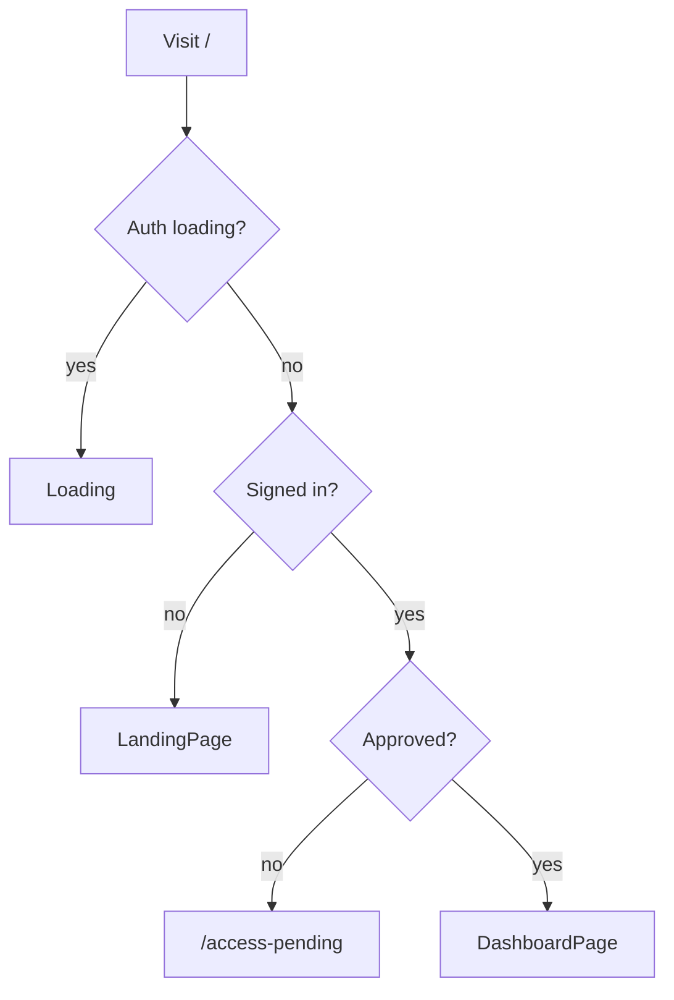

# Write Knuckles Marketing Landing Page

## Positioning

Lead with existing product voice: **“The back room where pulp gets written.”** Frame Write Knuckles as a Scrivener-style writing desk for long-form fiction — Tales, The Rack, Story Board, Beat Sheets — built for [Bronze Knuckles Magazine](https://bronzeknucklesmagazine.com). Market **shipping features only**; keep invite-only honesty in CTAs. Soft “coming soon” strip optional for Print Run / collaboration / grammar, not the hero pitch.

## Routing & auth gate

Today [`ApprovedRoute`](c:\Users\scott\Documents\code\write-knuckles\src\components\ApprovedRoute.jsx) sends logged-out users from `/` → `/signin`, so there is no public home.

**Change:** make `/` a smart root gate; keep `/signin` and `/reset` public.

- Add [`src/pages/RootPage.jsx`](c:\Users\scott\Documents\code\write-knuckles\src\pages\RootPage.jsx) implementing the gate above.
- In [`src/main.jsx`](c:\Users\scott\Documents\code\write-knuckles\src\main.jsx): `/` → `RootPage` (no `ApprovedRoute` wrapper). Other app routes unchanged.
- After sign-in, [`SigninPage`](c:\Users\scott\Documents\code\write-knuckles\src\pages\SigninPage.jsx) still `navigate('/')` — approved users hit the dashboard; guests who only browse `/` see marketing.

**Nav chrome:** Global [`NavBar`](c:\Users\scott\Documents\code\write-knuckles\src\components\NavBar.jsx) always renders today. Hide it on marketing (and optionally keep it on auth pages, or hide on `/signin`/`/reset` too for a cleaner guest funnel). Landing uses its own header instead.

- Wrap routes or conditionally render `NavBar` when path is not `/` (and not guest-only if we hide there).
- Guest `NavBar` today only has “Sign In” — landing header will carry **Sign Up** + **Sign In**.

## Page structure

New files (Tailwind, matching app tokens — ink `#1a1410`, surface `#2a2218`, bronze `#938938`, cream `#e8dcc8`, punch `#8b2635`; fonts Oswald + Courier Prime already in app):

| File | Role |
|------|------|
| [`src/pages/LandingPage.jsx`](c:\Users\scott\Documents\code\write-knuckles\src\pages\LandingPage.jsx) | Full marketing page |
| [`src/pages/LandingPage.scss`](c:\Users\scott\Documents\code\write-knuckles\src\pages\LandingPage.scss) | Hero atmosphere, motion, footer (scoped; avoid fighting Tailwind utility layout) |
| [`src/components/marketing/MarketingHeader.jsx`](c:\Users\scott\Documents\code\write-knuckles\src\components\marketing\MarketingHeader.jsx) | Sticky header |
| [`src/components/marketing/MarketingFooter.jsx`](c:\Users\scott\Documents\code\write-knuckles\src\components\marketing\MarketingFooter.jsx) | Site footer |
| [`src/pages/RootPage.jsx`](c:\Users\scott\Documents\code\write-knuckles\src\pages\RootPage.jsx) | Auth gate |

### Marketing header

- Brand: **Write Knuckles** → `/`
- In-page anchors: Features, Beat Sheets, Research, How it works
- CTAs: **Sign Up** → `/signin`, **Sign In** → `/signin` (signup already lives on SigninPage)
- Mobile: compact menu for anchors + CTAs

### Hero (first viewport — one composition)

Per design rules: brand first, one headline, one supporting line, one CTA group, one full-bleed product visual — no stat strips or card clusters in the hero.

- Brand title: Write Knuckles
- Headline: e.g. *Structure the story. Write the scene.*
- Support: *The back room where pulp gets written — Rack, Story Board, and Beat Sheets in one desk.*
- CTAs: primary **Sign Up** / **Get access** → `/signin`; secondary **Sign In** → `/signin`
- Note under CTAs: invite-only access
- Visual: full-bleed screenshot of the writing cockpit (`/marketing/hero-cockpit.png`) with atmospheric ink/noise gradient behind it — not an inset card

### Feature sections (below fold)

Each section: one purpose, one heading, short copy, one screenshot. Alternate image/text sides on desktop; stack on mobile.

1. **The Rack** — Scrivener-style chapter/scene outline; drag-reorder; status at a glance  
2. **Scene editor** — TipTap rich text, drop caps, ink/paper themes, autosave (“Locked in.”), word count  
3. **Story Board** — corkboard By Chapter / By Beat; draft status colors  
4. **Beat Sheets** — Save the Cat, Hero’s Journey, Three-Act Pulp, Story Circle, Blank; word progress; link scenes to structure  
5. **Research desk** — Characters, Locations, Research notes, tags; link cast/setting to scenes  
6. **Search** — full-text across scene prose; jump back into Write mode  

### Closing CTA band

- Invite-only restate + link to magazine  
- **Sign Up** / **Sign In** again  
- Optional one-liner: “Same account as Bronze Knuckles Magazine”

### Footer (marketing standard)

Columns roughly:

- **Product** — Features (#features), Beat Sheets, Research  
- **Account** — Sign Up, Sign In, Forgot password (`/reset`)  
- **Magazine** — Bronze Knuckles Magazine (external), About/submit as external magazine URLs  
- **Legal** — Privacy / Terms / Attributions → magazine routes (`https://bronzeknucklesmagazine.com/privacy` etc.) since write-knuckles has no legal pages yet  

Bottom bar: © year Write Knuckles · “Built for Bronze Knuckles Magazine”

## Visual / motion direction

- Dark pulp noir, not a light SaaS template; reuse existing CSS variables / Tailwind tokens from [`index.css`](c:\Users\scott\Documents\code\write-knuckles\src\index.css) and [`tailwind.config.js`](c:\Users\scott\Documents\code\write-knuckles\tailwind.config.js)
- Subtle paper grain / vignette in hero; bronze accent rules
- Motion (2–3 intentional): header fade-in, hero image slight scale-in or ken-burns-light, feature screenshots fade/slide on scroll (`prefers-reduced-motion` respected)
- Do **not** invent a cream-paper + terracotta marketing look that fights the app; stay ink/bronze/cream

## Screenshots — placeholders + shot list

No product screenshots exist under `public/` today (only `loading-skull.svg`). Ship `` tags with stable paths; until you drop files in, use a muted placeholder frame (dashed bronze border + caption) so layout doesn’t collapse.

**Save all under:** `write-knuckles/public/marketing/`

| Filename | Shot to take | Suggested capture |
|----------|--------------|-------------------|
| `hero-cockpit.png` | Full writing mode: Rack left, TipTap center, Inspector right; dark theme; filled scene | Wide ~1920×1080 browser window, `/tale/:id` Write mode |
| `feature-rack.png` | Rack with several chapters/scenes, one selected | Crop Rack panel or tall left third |
| `feature-editor.png` | Editor with toolbar, drop cap or divider, word count / “Locked in.” visible | Center editor pane |
| `feature-story-board.png` | Story Board **By Chapter** with colored status cards | Full Story Board mode |
| `feature-beat-sheet.png` | Beat Sheet timeline with linked scene chips + word bars | Beat Sheet mode |
| `feature-research.png` | Research panel showing Characters (or Locations) with tags | Research mode |
| `feature-search.png` | Search results with snippets | Search mode |

**Capture tips:** Use a demo Tale with realistic pulp titles (not lorem). Prefer dark editor theme for brand match. Export PNG; avoid personal email in NavBar (Sign Out / crop chrome if needed). Target ~2x Retina widths where easy (e.g. hero 2400px wide).

After you add the files, placeholders disappear automatically via normal `src` paths — no code change required if filenames match.

## App chrome tweaks

- [`NavBar.jsx`](c:\Users\scott\Documents\code\write-knuckles\src\components\NavBar.jsx): for signed-out users on non-landing pages (e.g. `/signin`), optionally add **Sign Up** next to Sign In for consistency — low priority if landing + signin are the main guest paths.
- [`main.jsx`](c:\Users\scott\Documents\code\write-knuckles\src\main.jsx): conditional `NavBar` via `useLocation` in a small `AppShell` component so `/` (landing) doesn’t double-header.

## Out of scope

- Privacy/Terms page implementations (footer links externally to the magazine)
- Redesigning SigninPage
- Marketing unreleased features as available
- Generating fake product UI screenshots with the image tool (you’ll supply real captures)