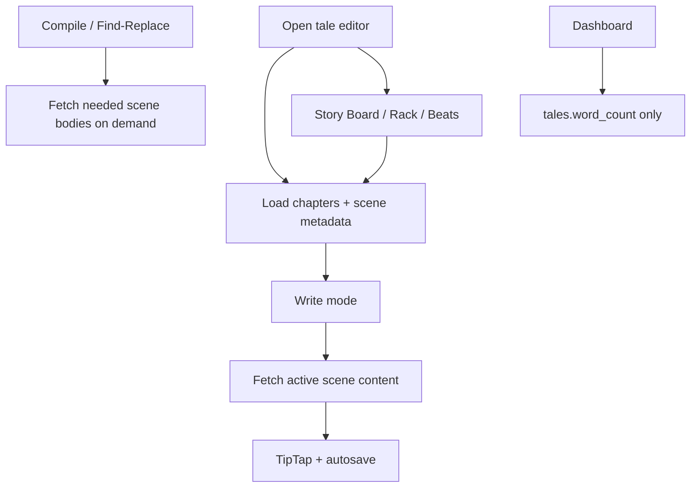

# Write Knuckles scalability — do-now plan

## Goal

Guard against the failure modes that hit **per-manuscript** and **dashboard/list** load before Supabase Pro is the bottleneck. Ship in three phases; each phase is independently mergeable and testable.

**Out of scope (later):** batch reorder RPC, RLS `auth.uid()` initplan rewrites, admin_usage_stats caching, image thumbnails, bigger compute.



## Current hot paths (baseline)

| Path | Today | Problem |
|------|-------|---------|
| Editor open | [`useTaleStructure`](c:\Users\scott\Documents\code\write-knuckles\src\hooks\useTaleStructure.js) `scenes.select('*')` | Downloads every TipTap JSON + `plain_text` |
| Dashboard | [`useTales`](c:\Users\scott\Documents\code\write-knuckles\src\hooks\useTales.js) `scenes(word_count, deleted_at)` | Nested scene rows only to sum words |
| Search / replace | [`SceneSearchPanel`](c:\Users\scott\Documents\code\write-knuckles\src\components\research\SceneSearchPanel.jsx) client `findInScenes(scenes)` | Assumes all bodies already in memory |
| Trash | [`useTaleTrash`](c:\Users\scott\Documents\code\write-knuckles\src\hooks\useTaleTrash.js) `select('*')` | Deleted scenes include full content |
| FTS RPC | [`write.search_scenes`](c:\Users\scott\Documents\code\write-knuckles\supabase\migrations\20260715010000_soft_delete_entities.sql) | Returns full `plain_text`, unbounded |

Live prod snapshot (2026-07-17): max tale ~1.1 MB content+plain / 65 scenes — already the shape that breaks first as novels grow.

---

## Phase 1 — Lazy scene content (P0)

**Goal:** Opening a tale loads the outline cheaply; only the active scene body hits the network. Compile and find/replace fetch bodies when those modes need them.

### 1A. Structure query (metadata only)

Update [`useTaleStructure.js`](c:\Users\scott\Documents\code\write-knuckles\src\hooks\useTaleStructure.js):

- Chapters: keep needed columns (or `*` if small — chapters are tiny).
- Scenes: **exclude** `content` and `plain_text`. Explicit select, e.g.:

```text
id, chapter_id, tale_id, user_id, title, synopsis, sort_order,
word_count, scene_status, scene_color, pov_character_id,
deleted_at, created_at, updated_at
```

(Adjust to match actual columns; never select `content` / `plain_text` here.)

Rack, Story Board, Beat Sheet, Inspector word counts keep working off metadata.

### 1B. `useSceneContent(sceneId)` hook

New hook (e.g. [`src/hooks/useSceneContent.js`](c:\Users\scott\Documents\code\write-knuckles\src\hooks\useSceneContent.js)):

- Query key: `['scene-content', sceneId]`
- `select('id, content, plain_text, updated_at')` for one scene
- Enabled when `sceneId` is set
- Optional: prefetch adjacent scenes on `activeSceneId` change (nice-to-have in same PR if cheap)

### 1C. Wire Write mode

[`TaleEditorPage.jsx`](c:\Users\scott\Documents\code\write-knuckles\src\pages\TaleEditorPage.jsx) + [`SceneEditor.jsx`](c:\Users\scott\Documents\code\write-knuckles\src\components\editor\SceneEditor.jsx):

- Merge structure metadata + fetched content for the active scene
- Show a short loading state when switching scenes before content arrives
- Keep existing flush-on-switch behavior in `handleSelectScene`

[`useAutosave.js`](c:\Users\scott\Documents\code\write-knuckles\src\hooks\useAutosave.js):

- On success, patch `['scene-content', sceneId]` **and** structure metadata (`word_count`, `updated_at`)
- Do **not** require structure cache to hold `content`

### 1D. Bulk consumers — fetch on demand

These currently assume `scene.content` is already on the structure object:

| Consumer | Approach |
|----------|----------|
| Compile ([`TaleCompileModal`](c:\Users\scott\Documents\code\write-knuckles\src\components\tale\TaleCompileModal.jsx) → [`buildManuscriptModel`](c:\Users\scott\Documents\code\write-knuckles\src\lib\compile\buildManuscriptModel.js)) | Before build: load all (or scoped) scene `content`/`plain_text` for the tale in one query, merge onto chapters, then compile |
| Find/replace ([`SceneSearchPanel`](c:\Users\scott\Documents\code\write-knuckles\src\components\research\SceneSearchPanel.jsx) + [`findReplace.js`](c:\Users\scott\Documents\code\write-knuckles\src\lib\editor\findReplace.js)) | On Search mode entry or first query ≥2 chars: fetch bodies once into a React Query cache (`['tale-scene-bodies', taleId]`), run client find/replace against that; invalidate on replace success |
| [`DashboardTaleModals`](c:\Users\scott\Documents\code\write-knuckles\src\components\tale\DashboardTaleModals.jsx) | Uses structure only if possible; if it needs bodies, same on-demand fetch |

**Build decision (locked):** Keep client-side find/replace for now (preserves match-case / partial-match UX). Do **not** rewrite Search onto `search_scenes` in Phase 1. Phase 3 still caps the unused/underused FTS RPC and trash.

**Build decision:** One helper `fetchTaleSceneBodies(taleId, { sceneIds? })` shared by compile + search to avoid duplicated selects.

### Phase 1 acceptance

- [ ] Network tab on editor open: scene list response has no TipTap JSON blobs
- [ ] Switching scenes fetches one scene body; Write editing + autosave still work
- [ ] Compile still produces full manuscript
- [ ] Find/replace still finds and replaces across scenes
- [ ] Story Board / Rack / Beat Sheet unchanged functionally

### Phase 1 test plan

- Open largest local/sample tale; confirm structure payload << previous
- Edit, autosave, switch scene, switch back — content correct
- Compile all scenes; spot-check HTML
- Search + replace across 2+ scenes; verify DB rows

---

## Phase 2 — Denormalized `tales.word_count` (P0)

**Goal:** Dashboard lists tales without nested scene rows.

### 2A. Migration

New migration via `supabase migration new tale_word_count` (per [supabase-migrations rule](c:\Users\scott\Documents\code\write-knuckles\.cursor\rules\supabase-migrations.mdc)):

1. `alter table write.tales add column word_count int not null default 0`
2. Backfill:

```sql
update write.tales t
set word_count = coalesce((
  select sum(s.word_count)
  from write.scenes s
  where s.tale_id = t.id and s.deleted_at is null
), 0);
```

3. Trigger (or triggers) to keep in sync on:
   - `scenes` INSERT / UPDATE of `word_count` or `deleted_at` / hard DELETE
   - Soft-delete and restore paths that set `deleted_at`
4. Prefer one `SECURITY INVOKER` function that recomputes `sum(word_count)` for `tale_id` and assigns `tales.word_count` — simple and correct; optimize later if needed.

Also bump `tales.updated_at` only if product already expects that on scene edits (autosave already updates scene + invalidates tales — confirm we do not double-invalidate oddly).

### 2B. Client

[`useTales.js`](c:\Users\scott\Documents\code\write-knuckles\src\hooks\useTales.js):

- Change select to tale columns only (include `word_count`)
- Remove nested `scenes(word_count, deleted_at)` and client `reduce`
- Create-tale path: new tale stays `0` until first scene words exist (default OK)

[`useAutosave`](c:\Users\scott\Documents\code\write-knuckles\src\hooks\useAutosave.js) / scene soft-delete mutations: keep `invalidateQueries(['tales'])` so dashboard refreshes (or optimistically patch tale word_count if easy).

### Phase 2 acceptance

- [ ] Dashboard tale cards show correct totals vs summing scenes in SQL
- [ ] Soft-delete scene → tale word_count drops; restore → rises
- [ ] No nested `scenes(...)` in the tales list request

### Phase 2 test plan

- Create tale, type words, refresh dashboard
- Soft-delete / restore scene; confirm card total
- `supabase db reset` + seed; spot-check backfill

---

## Phase 3 — Cap search + trash payloads (P1)

**Goal:** Modes that touch many rows never pull full documents by default.

### 3A. Trash metadata only

[`useTaleTrash.js`](c:\Users\scott\Documents\code\write-knuckles\src\hooks\useTaleTrash.js):

- Scenes: select metadata only (title, deleted_at, chapter_id, word_count, …) — **not** `content` / `plain_text`
- Other entities: drop unused wide columns if any; keep what TrashPanel labels need
- Restore / permanent delete already use ids only — no content required

### 3B. FTS RPC payload cap

Even though Write Search is client-side today, [`write.search_scenes`](c:\Users\scott\Documents\code\write-knuckles\supabase\migrations\20260715010000_soft_delete_entities.sql) is a footgun if anything calls it later ([`useSceneSearch`](c:\Users\scott\Documents\code\write-knuckles\src\hooks\useSceneSearch.js) exists).

Migration:

- Replace full `plain_text` with a short snippet (`ts_headline` or `left(plain_text, N)`)
- Add `limit 50` (or similar) ordered by rank
- Keep return shape compatible or update `useSceneSearch` consumers in the same PR

**Build decision:** Limit = 50; snippet ≈ 200–280 chars. Document in migration comment.

### 3C. Optional follow-up in same phase (if cheap)

When Search mode loads `['tale-scene-bodies', taleId]`, show a lightweight progress state for large tales so users understand the one-time fetch. Not a new architecture — UX only.

### Phase 3 acceptance

- [ ] Trash network responses contain no TipTap JSON
- [ ] `search_scenes` returns snippets + ≤50 rows
- [ ] Trash restore / delete still work

---

## Suggested PR / commit sequence

1. **PR A — Phase 1** (largest; most UX risk) — lazy content + compile/search on-demand bodies  
2. **PR B — Phase 2** — migration + `useTales` simplification  
3. **PR C — Phase 3** — trash selects + `search_scenes` limit/snippet  

Do not combine A+B unless needed; Phase 2 is small and easy to review alone.

## Rollout notes

- Develop/test with `supabase db reset` locally; deploy migrations with `supabase db push` (dry-run first on prod per repo rule).
- No Edge Functions required.
- No schema change for Phase 1 (select-list only) — safest first ship.
- Phase 2 is the only phase that needs a careful backfill + trigger.

## Success metric

After Phase 1+2, opening a 65-scene tale should transfer **outline kilobytes**, not ~1 MB of manuscript, on the critical path; dashboard tale list should be **O(tales)**, not O(scenes).
