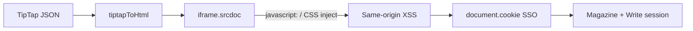
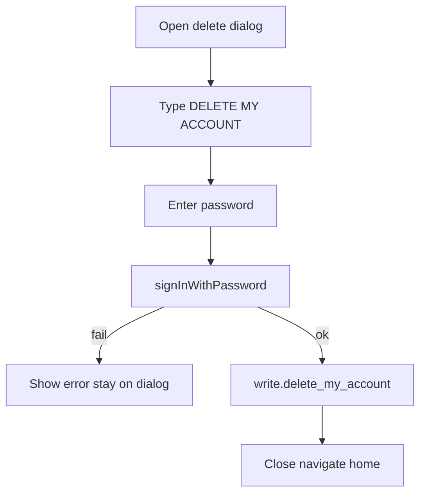
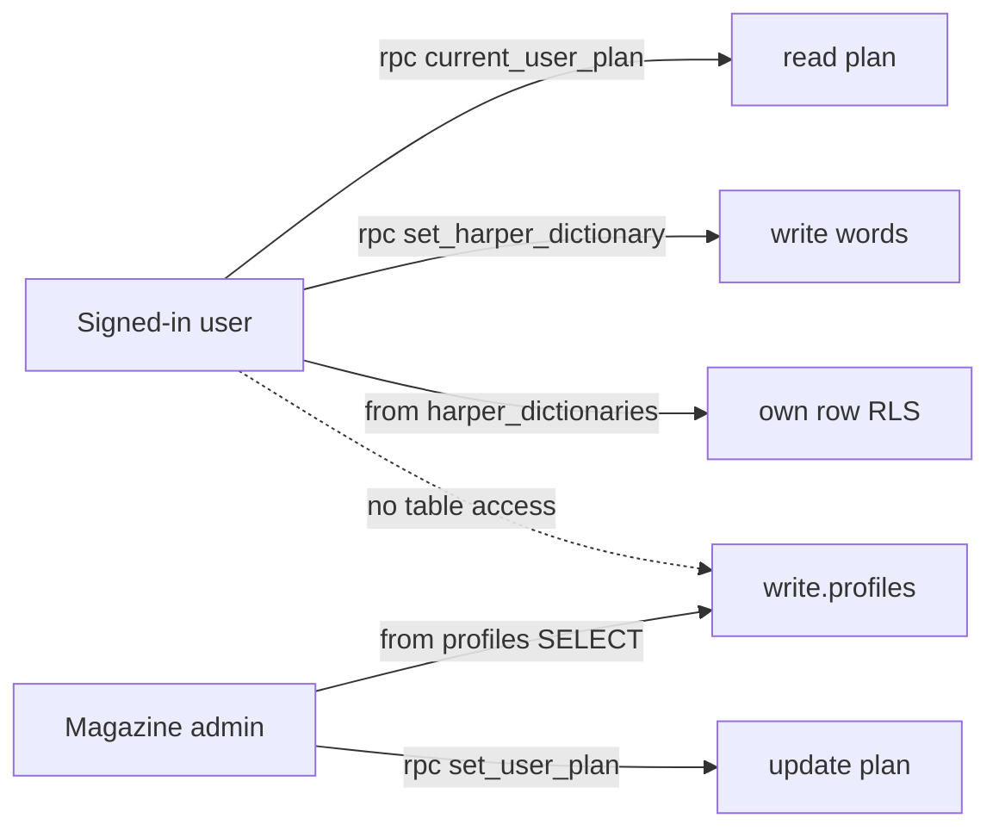

# Write Knuckles security remediation plan

## Context

Write Knuckles is a Vite/React SPA with no app-owned API. Authorization lives in Supabase RLS, Storage policies, and `SECURITY DEFINER` RPCs. The highest risk is **XSS → JS-readable SSO cookies** amplifying into both Write and bronze-knuckles magazine data.

**Closed beta:** [`write.approved_users`](c:\Users\scott\Documents\code\write-knuckles\supabase\migrations\20250710143000_write_knuckles_bootstrap.sql) is a **temporary** invite allowlist so only manually approved emails can use the product during closed beta. It will be **removed at launch**. That does **not** change Critical/High work (XSS, RPC grants, account deletion, admin trust). It **does** change how we treat invite/approval hardening:

- Do **not** build invite tokens or long-lived approval UX as security investment.
- **Email confirmation is already required:** signup does not enable the account until the user clicks the link in the confirmation email ([SigninPage](c:\Users\scott\Documents\code\write-knuckles\src\pages\SigninPage.jsx) confirm UX). That closes the main invite-hijack path (attacker cannot bind an approved email without inbox access). Residual beta risk is low; no further invite hardening needed.
- Do **not** couple feature-request or other lasting product policies to `is_approved_user()` — use `auth.uid()` (and rate limits later) so launch does not require undoing those gates.
- At launch, plan a dedicated migration to drop `approved_users` / `is_approved_user()` from RLS (separate from this remediation).



## Phase 1 — XSS and session blast radius (Critical)

**Goal:** Stop compile/editor HTML from executing attacker-controlled scripts, and reduce impact if XSS still occurs.

Unaffected by temporary `approved_users`.

| Area | Files | Work |
|------|-------|------|
| Link allowlist | [src/lib/editor/extensions.js](c:\Users\scott\Documents\code\write-knuckles\src\lib\editor\extensions.js) | `Link.configure({ protocols: ['http', 'https'], openOnClick: false })` |
| Compile sanitization | [src/lib/compile/tiptapToHtml.js](c:\Users\scott\Documents\code\write-knuckles\src\lib\compile\tiptapToHtml.js) | Allow only `http:`/`https:` hrefs; sanitize highlight color, `textAlign`, `scriptRole` per **Build decisions** below |
| Compile iframe | [src/components/tale/CompileViewer.jsx](c:\Users\scott\Documents\code\write-knuckles\src\components\tale\CompileViewer.jsx) | `sandbox="allow-scripts allow-same-origin allow-modals"` — keep `contentDocument` for Paged.js/print; see **Build decisions — Compile iframe** |
| postMessage | [src/lib/compile/pagedPreview.js](c:\Users\scott\Documents\code\write-knuckles\src\lib\compile\pagedPreview.js), [src/lib/compile/pageGuides.js](c:\Users\scott\Documents\code\write-knuckles\src\lib\compile\pageGuides.js) | Replace `postMessage(..., '*')` with explicit `window.location.origin`; keep `event.source` checks |
| CSP / headers | Deploy config (e.g. Cloudflare Pages `_headers` or equivalent — none in-repo today) | Add CSP, `X-Content-Type-Options`, `Referrer-Policy`, HSTS, `Permissions-Policy` |

### Build decisions — Compile sanitization (locked for implementation)

These are product/security choices for when we implement. Defaults match current editor behavior so legitimate content keeps working.

1. **Invalid / unsafe values → omit the attribute or mark wrapper; keep the text.**  
   Never throw; never pass the raw value through. Example: bad highlight → plain text (or `<mark>` without `style`); bad `scriptRole` → normal paragraph with no `data-script-role` / role class.

2. **Highlight colors → CSS hex only.**  
   Allow `#rgb`, `#rrggbb`, `#rrggbbaa` (case-insensitive). Reject named colors, `rgb()`, `hsl()`, and anything with `;`, quotes, or `url(`. Matches the toolbar color picker ([`DEFAULT_HIGHLIGHT_COLOR = '#ffe066'`](c:\Users\scott\Documents\code\write-knuckles\src\components\editor\EditorToolbar.jsx)).

3. **`textAlign` → `left` \| `center` \| `right` only.**  
   Same set as the editor toolbar. Anything else is dropped (default visual = left).

4. **`scriptRole` → exact set from [`SCRIPT_ROLES`](c:\Users\scott\Documents\code\write-knuckles\src\lib\editor\scriptStyles.js):**  
   `panel`, `panelDescription`, `character`, `characterDescriptor`, `dialogue`, `sfx`, `sfxContent`.  
   Reuse that constant (or `Object.values(SCRIPT_ROLES)`) in the compiler so editor and compile stay in sync. Also gates the `script-role--${role}` class name.

5. **Links in compile → `http:` and `https:` only.**  
   No `mailto:`, relative paths, or protocol-relative `//…` unless we later add them deliberately. Same rule as TipTap Link allowlist.

6. **Same sanitizer for preview and export.**  
   `tiptapToHtml` (and any shared helpers) must be used for both `srcdoc` preview and downloaded HTML so export cannot be a weaker path.

7. **Also escape every emitted attribute value** with existing `escapeHtml`, even after allowlisting.

**Not a user decision (do it):** tighten `sanitizeCssValue` usage for highlight the same way; keep `fontFamily` / `fontSize` on the existing sanitizer unless we later allowlist fonts explicitly.

### Build decisions — Compile iframe (locked for implementation)

**Keep parent `contentDocument` access** (no opaque-origin sandbox refactor). Paged.js, page guides, and print stay as they are today.

Concrete fix in [`CompileViewer.jsx`](c:\Users\scott\Documents\code\write-knuckles\src\components\tale\CompileViewer.jsx):

```jsx
<iframe
  ref={iframeRef}
  title={title}
  srcDoc={html}
  sandbox="allow-scripts allow-same-origin allow-modals"
  className="h-full w-full flex-1 border-0 bg-[#e5dfd3]"
/>
```

| Flag | Why |
|------|-----|
| `allow-scripts` | Paged.js boot scripts must run |
| `allow-same-origin` | Parent can use `contentDocument` / `contentWindow` for pagination, guides, fonts, print |
| `allow-modals` | `contentWindow.print()` / print dialog must work |

**Intentionally omitted** (browser defaults deny these when `sandbox` is present): `allow-top-navigation`, `allow-forms`, `allow-popups`, `allow-downloads` (unless print/save flows prove we need downloads — verify during build).

**What this does / does not do:**
- Does: blocks top-window navigation, form posts, and popups from preview HTML even if something hostile reaches `srcdoc`.
- Does **not**: stop same-origin script in the iframe from reading SSO cookies. Cookie theft still depends on Link allowlist + compile sanitization (+ later CSP).

**Verify on build:** pagination, page-guide toggle, print, and recompile still work with the sandbox attribute present.

**postMessage + sandbox note:** sandboxed `srcdoc` iframes often report `event.origin` as the literal `"null"`. Boot scripts must `postMessage` to an injected parent origin; the parent accepts `event.origin === window.location.origin || event.origin === 'null'` when `event.source` is the iframe. Parent→iframe guide messages use target `'*'` with the iframe checking `PARENT_ORIGIN`.

**SSO cookies:** [src/lib/authStorage.js](c:\Users\scott\Documents\code\write-knuckles\src\lib\authStorage.js) stores sessions via `document.cookie` (not HttpOnly). Full HttpOnly SSO needs a BFF/SSR layer and is a larger product change. Phase 1 treats XSS/CSP as the primary control; HttpOnly migration stays later unless you decide otherwise.

## Phase 2 — RPC and grant lockdown (Critical)

**Goal:** Align grants with intent. Live advisors show `anon` can EXECUTE many `write.*` SECURITY DEFINER functions because bootstrap granted ALL to `anon`.

Unaffected by temporary `approved_users` (grants are still wrong with or without the allowlist).

New migration under [supabase/migrations/](c:\Users\scott\Documents\code\write-knuckles\supabase\migrations):

1. `REVOKE EXECUTE ON ALL FUNCTIONS IN SCHEMA write FROM anon, public;`
2. Re-`GRANT EXECUTE` only to `authenticated` for intentional client RPCs (`delete_my_account`, `list_registered_users`, `set_user_plan`, `link_approved_user`, `list_feature_requests`, `merge_feature_requests`, `set_harper_dictionary`, helpers used by RLS if they must be callable, etc.)
3. Leave trigger-only functions (`handle_new_user_profile`, `sync_character_avatar_from_hero`, `set_updated_at`) with **no** client EXECUTE
4. Guard [`list_feature_requests`](c:\Users\scott\Documents\code\write-knuckles\supabase\migrations\20250710143000_write_knuckles_bootstrap.sql) with `auth.uid() IS NOT NULL` only — **not** `is_approved_user()` — so unauthenticated dumps stop without coupling to the temporary beta gate
5. Pin `search_path` on `write.set_updated_at` (advisor WARN)

Also stop future bleed: document that new migrations must not `GRANT … TO anon` on `write` routines (bootstrap already granted default privileges — tighten default privileges for `anon` in the same migration if safe).

## Phase 3 — Account deletion and admin trust (High)

Unaffected by temporary `approved_users` (`delete_my_account` already clears approval rows as part of wipe; that cleanup simply disappears with the table at launch).

### Account deletion (locked UX)

Replace the current one-click `confirmAction` in [`ProfileDialog.jsx`](c:\Users\scott\Documents\code\write-knuckles\src\components\ProfileDialog.jsx) with a dedicated delete-account dialog (modal rules: no backdrop dismiss; explicit Cancel / confirm only).

**Required before calling `delete_my_account`:**

1. **Password** — user re-enters their account password. Verify with `supabase.auth.signInWithPassword({ email: user.email, password })` using the signed-in user’s email. On failure, show an error and do **not** call the RPC.
2. **Exact phrase** — user must type `DELETE MY ACCOUNT` into a text field (exact match, case-sensitive). Confirm button stays disabled until the phrase matches. This is intentional friction / mis-click protection.



**Implementation notes:**

- Wire through [`AuthContext.deleteAccount`](c:\Users\scott\Documents\code\write-knuckles\src\contexts\AuthContext.jsx) / [`deleteAccount.js`](c:\Users\scott\Documents\code\write-knuckles\src\lib\deleteAccount.js): accept password, verify first, then RPC.
- Keep warning copy about permanent wipe of Tales, images, and magazine submissions.
- Soft-delete / grace period: **out of scope** for this pass.
- Phrase check is client-side only (cannot be enforced meaningfully in SQL without a useless param). **Password re-auth is the security control** against a stolen session without the password.

### Admin / plans + Harper split (locked)

**`public."Admins"` RLS:** Confirmed live — RLS on; clients only have SELECT where `auth.uid() = user_id`; no client INSERT/UPDATE/DELETE policies. No Write-repo change needed.

**`write.profiles` = admin plan store only (no end-user table access):**

- Drop policy `"Users read own profile"`.
- Keep admin SELECT on `profiles`.
- Drop broad `"Magazine admins update profiles"` — plan changes **only** via `write.set_user_plan` (SECURITY DEFINER).
- Client plan load in [`AuthContext.checkPlan`](c:\Users\scott\Documents\code\write-knuckles\src\contexts\AuthContext.jsx) switches from `.from('profiles').select('plan')` to `writeDb.rpc('current_user_plan')` (already exists; grant already present).

**Harper dictionary → separate table** (users never touch `profiles`):

New table `write.harper_dictionaries`:

- `user_id uuid primary key references auth.users(id) on delete cascade`
- `words text[] not null default '{}'`
- `updated_at timestamptz not null default now()`
- RLS: owner SELECT / INSERT / UPDATE / DELETE (`auth.uid() = user_id`) only
- Migrate existing `profiles.harper_dictionary` rows into this table, then `alter table write.profiles drop column harper_dictionary`

Update [`write.set_harper_dictionary`](c:\Users\scott\Documents\code\write-knuckles\supabase\migrations\20260714121000_add_harper_dictionary.sql) to upsert `write.harper_dictionaries` only.

Update [`src/lib/harper/dictionary.js`](c:\Users\scott\Documents\code\write-knuckles\src\lib\harper\dictionary.js): `fetchHarperDictionary` reads from `harper_dictionaries` (not `profiles`).

Grant EXECUTE on `set_harper_dictionary` remains for `authenticated` (already in Phase 2 migration).



## Phase 4 — Auth platform and abuse (Medium)

Dashboard / platform (not all in git):

- Enable HaveIBeenPwned leaked-password protection (advisor WARN)
- Upgrade Postgres for outstanding patches (advisor WARN)
- **Email confirmation:** already required (existing control). Do not add “verify confirm email” work; keep it enabled at launch when `approved_users` goes away
- Client password min-length UX on Signin/Reset ([SigninPage.jsx](c:\Users\scott\Documents\code\write-knuckles\src\pages\SigninPage.jsx), [ResetPage.jsx](c:\Users\scott\Documents\code\write-knuckles\src\pages\ResetPage.jsx))

Product abuse:

- Feature requests: require authenticated user only (`auth.uid()`). During beta, unapproved users can still hit this surface if they have an account — acceptable given the allowlist is temporary; at launch add rate limits / length caps instead of approval coupling
- Keep storage server MIME/size; leave external image HTTPS validation as-is unless clarifying wants re-hosting

## Phase 5 — Defense in depth (Low / later)

- HttpOnly cross-subdomain auth via BFF (replaces [authStorage.js](c:\Users\scott\Documents\code\write-knuckles\src\lib\authStorage.js) cookie pattern)
- Soft-delete RLS filters if deleted rows must be hidden from API
- MFA for magazine admins
- Align cookie-consent copy with auth cookie behavior
- **Skipped:** invite tokens / permanent approval-table hardening (table goes away at launch)

## Launch follow-up (separate from this remediation)

When opening the product:

- Migration to remove `write.approved_users`, `is_approved_user()`, `link_approved_user()`, and RLS/storage checks that require approval
- Drop Access Admin invite UI / `ApprovedRoute` gates; keep plan entitlements and magazine `Admins` as needed
- Revisit feature-request spam controls (rate limit) once signup is open

## Verification

- Manual: compile preview with `javascript:` link and CSS-injection highlight; confirm no execution / no session theft path
- Manual: unauthenticated `POST /rest/v1/rpc/list_feature_requests` returns 401/403
- Manual: anon cannot call admin RPCs; authenticated non-admin still denied
- `supabase db advisors` security clean (or only intentional authenticated-definer warnings)
- Regression: Paged.js pagination, page guides, SSO on production cookie domain, account delete still works for signed-in user

## Out of scope until you say otherwise

- Implementing bronze-knuckles Admins RLS changes (sibling repo)
- Full HttpOnly SSO / SSR rewrite
- Stripe checkout / entitlement redesign
- Permanent invite-token / approved_users product redesign
- Launch migration to remove the beta allowlist (tracked as follow-up only)

## Clarifications next

Further questions can still change priority (SSO cookie strategy). Email confirmation, temporary `approved_users`, and account-delete step-up (password + `DELETE MY ACCOUNT`) are settled.
