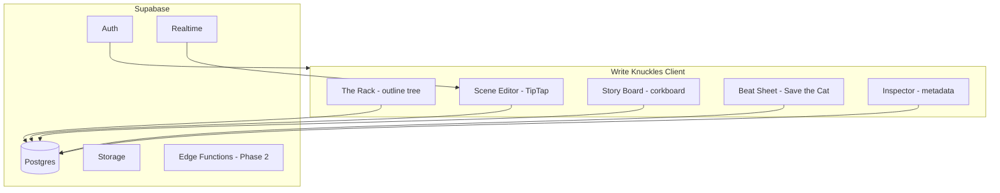
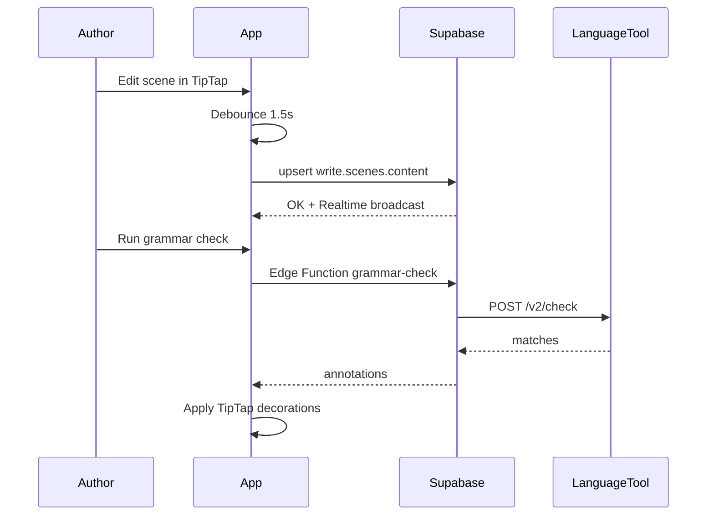

# Write Knuckles — Phase 1: Writing Mode

## Vision

**Write Knuckles** is the author’s back room for *Bronze Knuckles Magazine* — hard-hitting pulp fiction with a noir edge. Where Scrivener has binders and scenes, we have **The Rack**, **Chapters**, and **Scenes**. The **Story Board** is your corkboard view. Story structure isn’t abstract — it’s a **Beat Sheet** you can walk like Save the Cat, Hero’s Journey, or a custom pulp arc.

Phase 2 (layout/publishing) is intentionally foreshadowed in the data model but not built yet.



---

## Current Progress (as of M4 complete)

**Resume here:** M5 — Grammar, readability stats, Markdown export (`grammar-polish` todo)

**Repo:** https://github.com/Scott-Mollon/write-knuckles

| Area | Status | Key files |
|------|--------|-----------|
| Project scaffold | Done | [`package.json`](C:\Users\scott\Documents\code\write-knuckles\package.json), [`src/main.jsx`](C:\Users\scott\Documents\code\write-knuckles\src\main.jsx) |
| DB migration | Deployed | [`001`](C:\Users\scott\Documents\code\write-knuckles\supabase\migrations\001_write_knuckles_schema.sql)–[`006`](C:\Users\scott\Documents\code\write-knuckles\supabase\migrations\006_scene_reference_links.sql) |
| Auth + SSO | Done | [`AuthContext.jsx`](C:\Users\scott\Documents\code\write-knuckles\src\contexts\AuthContext.jsx), [`authStorage.js`](C:\Users\scott\Documents\code\write-knuckles\src\lib\authStorage.js) |
| Sign-in UX | Done | [`SigninPage.jsx`](C:\Users\scott\Documents\code\write-knuckles\src\pages\SigninPage.jsx) — invite-only disclaimer; [`Password.jsx`](C:\Users\scott\Documents\code\write-knuckles\src\components\Password.jsx) — bronze-knuckles eye icons |
| SSO production | **Verified** | `VITE_COOKIE_DOMAIN=.bronzeknucklesmagazine.com` on both apps |
| Cloudflare deploy | Done (write app) | Build output: `dist/` |
| Invite-only access | Done | [`ApprovedRoute.jsx`](C:\Users\scott\Documents\code\write-knuckles\src\components\ApprovedRoute.jsx), [`AccessAdminPage.jsx`](C:\Users\scott\Documents\code\write-knuckles\src\pages\AccessAdminPage.jsx) |
| Tale dashboard | Done | [`DashboardPage.jsx`](C:\Users\scott\Documents\code\write-knuckles\src\pages\DashboardPage.jsx) |
| New Tale wizard | Done | [`NewTalePage.jsx`](C:\Users\scott\Documents\code\write-knuckles\src\pages\NewTalePage.jsx) |
| Tale settings | Done | [`TaleSettingsModal.jsx`](C:\Users\scott\Documents\code\write-knuckles\src\components\tale\TaleSettingsModal.jsx), [`useUpdateTale`](C:\Users\scott\Documents\code\write-knuckles\src\hooks\useTales.js) — title, subtitle, genre, target words, beat sheet change |
| Tale editor (Write mode) | **Done** | [`TaleEditorPage.jsx`](C:\Users\scott\Documents\code\write-knuckles\src\pages\TaleEditorPage.jsx), [`SceneEditor.jsx`](C:\Users\scott\Documents\code\write-knuckles\src\components\editor\SceneEditor.jsx), [`Rack.jsx`](C:\Users\scott\Documents\code\write-knuckles\src\components\rack\Rack.jsx), [`Inspector.jsx`](C:\Users\scott\Documents\code\write-knuckles\src\components\inspector\Inspector.jsx) |
| TipTap editor | Done | StarterKit, drop caps, scene dividers, autosave 1.5s, word count, **dark/light theme** ([`useEditorTheme.js`](C:\Users\scott\Documents\code\write-knuckles\src\hooks\useEditorTheme.js)), rotating placeholders ([`scenePlaceholders.js`](C:\Users\scott\Documents\code\write-knuckles\src\constants\scenePlaceholders.js)) |
| Chapter titles | Done | [`ChapterTitleInput.jsx`](C:\Users\scott\Documents\code\write-knuckles\src\components\chapters\ChapterTitleInput.jsx), [`chapters.js`](C:\Users\scott\Documents\code\write-knuckles\src\lib\chapters.js) — number + custom title in Rack & Story Board |
| Story Board | Done | [`StoryBoard.jsx`](C:\Users\scott\Documents\code\write-knuckles\src\components\story-board\StoryBoard.jsx) — **By Chapter** (default) + **By Beat** views; chapter reorder; +Chapter/+Scene; beat drag link/unlink + unlinked pool |
| Beat Sheet | Done | [`BeatSheet.jsx`](C:\Users\scott\Documents\code\write-knuckles\src\components\beats\BeatSheet.jsx) — timeline, linked scene chips, link/unlink, change beat sheet |
| Beat linking UI | Done | [`useBeatLinks.js`](C:\Users\scott\Documents\code\write-knuckles\src\hooks\useBeatLinks.js), Inspector + Beat Sheet + Story Board By Beat; **one scene per beat**; labels `Chapter N — Title — Scene` ([`scenes.js`](C:\Users\scott\Documents\code\write-knuckles\src\lib\scenes.js)) |
| Beat sheet apply | Done | [`BeatSheetPicker.jsx`](C:\Users\scott\Documents\code\write-knuckles\src\components\beats\BeatSheetPicker.jsx), [`useApplyBeatTemplate.js`](C:\Users\scott\Documents\code\write-knuckles\src\hooks\useApplyBeatTemplate.js) |
| Beat word progress | Done | [`BeatWordBar.jsx`](C:\Users\scott\Documents\code\write-knuckles\src\components\beats\BeatWordBar.jsx) — per-beat word budget (span since previous beat); header linked-beat count |
| Autosave polish | Done | Whitespace-only scenes not persisted ([`plainText.js`](C:\Users\scott\Documents\code\write-knuckles\src\lib\editor\plainText.js), [`useAutosave.js`](C:\Users\scott\Documents\code\write-knuckles\src\hooks\useAutosave.js)) |
| Characters / Locations / Research | **Done** | [`ReferencePanel.jsx`](C:\Users\scott\Documents\code\write-knuckles\src\components\research\ReferencePanel.jsx), [`useTaleReference.js`](C:\Users\scott\Documents\code\write-knuckles\src\hooks\useTaleReference.js) |
| Scene ↔ character/location links | Done | [`SceneReferenceLinks.jsx`](C:\Users\scott\Documents\code\write-knuckles\src\components\inspector\SceneReferenceLinks.jsx), migration `006` |
| Full-text scene search | Done | [`SceneSearchPanel.jsx`](C:\Users\scott\Documents\code\write-knuckles\src\components\research\SceneSearchPanel.jsx), `write.search_scenes` RPC |
| Grammar / export | Not started | — |
| Tale collaborators (M6) | Not started | Schema + RLS planned in migration `006` |

**After Phase 1 (M6+):** Collaborators → real-time co-editing → Print Run → AI insights. See [Post–Phase 1 Milestones](#postphase-1-milestones-m6).

---

## Repo & Stack

**Home:** [`write-knuckles`](C:\Users\scott\Documents\code\write-knuckles) — new repo, separate from the magazine site in [`bronze-knuckles`](C:\Users\scott\Documents\code\bronze-knuckles).

| Layer | Choice | Why |
|-------|--------|-----|
| Framework | React 19 + **JavaScript (JSX)** + Vite 7 | Matches magazine site stack and your familiarity |
| Routing | React Router 7 | Multi-view app shell |
| Data | **Supabase JS v2** + TanStack Query | Auth, Postgres, Realtime, future Edge Functions |
| Editor | **TipTap 2** (ProseMirror) | Extensible rich text, JSON document model, spellcheck-friendly |
| UI | Tailwind CSS 4 + **shadcn/ui** | Fast, accessible components; easy pulp theming |
| Forms/validation | React Hook Form + Zod | Beat sheets, metadata, settings |
| Drag & drop | @dnd-kit | Reorder chapters/scenes, Story Board |
| Grammar/spell | **LanguageTool Public API** (Phase 1) | Server-side keys via Edge Function; upgrade path to self-hosted LT |
| State | Zustand (UI) + TanStack Query (server) | Thin, predictable |
| Deploy | Cloudflare Pages + Supabase (same pattern as magazine) | Consistent with your existing infra |

**Magazine site reference (LIVE branch):** [`bronze-knuckles`](C:\Users\scott\Documents\code\bronze-knuckles) on branch `LIVE` — React 19 + Vite 7 + React Router 7 + Supabase JS v2.50 + SCSS. Auth and submission workflow already live.

**Stack note:** Write Knuckles stays **JavaScript throughout** — same language as the magazine. Auth pages port directly (JS + SCSS); writing cockpit uses JSX + Tailwind. No TypeScript.

**Deferred to later milestones:** AI writing insights (M9), real-time co-editing (M7), offline PWA. **Shared Tale access (M6)** is the first post–Phase 1 feature — multiple approved users on one manuscript; last-write-wins autosave until Yjs lands in M7.

---

## Domain Language

Standard writing terms with pulp flavor where it fits:

| Concept | Write Knuckles | Description |
|---------|----------------|-------------|
| Manuscript | **Tale** | A novel, novella, or serial |
| Chapter / part | **Chapter** | Major structural unit in The Rack (tree via `parent_id` optional) |
| Scene | **Scene** | Atomic writing unit with TipTap body text |
| Corkboard view | **Story Board** | Grid of scene cards — synopsis, status, color |
| Story structure | **Beat Sheet** | Save the Cat / Hero's Journey / etc. timeline per tale |
| Research | **Research** | Notes, links, reference files |
| Characters | **Characters** | Character sheets (`write.characters`) |
| Locations | **Locations** | Setting sheets (`write.locations`) |
| Synopsis | **The Pitch** | Logline + back-cover copy (future) |
| Export | **Print Run** | Phase 2 — layout + PDF/ePub |

Scene status labels: `Raw`, `Drafted`, `Rewritten`, `Final`.

New tales seed **Chapter 1** (empty custom title) + **Scene 1**. Display: `Chapter N` or `Chapter N — Custom Title` via [`formatChapterLabel`](C:\Users\scott\Documents\code\write-knuckles\src\lib\chapters.js).

---

## Data Model (Supabase Postgres)

All Write Knuckles tables live in the **`write` schema**. Magazine tables stay in `public`. `uuid` PKs, `user_id` FK to `auth.users`, RLS enabled.

### Core writing

```sql
-- write.tales: top-level manuscript
write.tales (
  id, user_id, title, subtitle, genre, target_word_count,
  beat_template_id,  _progress jsonb,
  created_at, updated_at, archived_at
)

-- write.chapters: ordered chapters/parts (tree optional via parent_id)
write.chapters (
  id, tale_id, user_id, parent_id nullable,
  title, sort_order, synopsis,
  created_at, updated_at
)

-- write.scenes: scenes with TipTap JSON body
write.scenes (
  id, chapter_id, tale_id, user_id,
  title, sort_order, scene_color, scene_status,
  content jsonb,           -- TipTap document
  plain_text text,          -- generated for search + word count
  word_count int,
  created_at, updated_at
)
```

### Story structure

```sql
-- beat_templates: built-in + user-custom
beat_templates (
  id, user_id nullable,     -- null = system template
  name, slug, description,
  structure jsonb           -- ordered beats with act %, guidance text
)

-- tale_beats: instantiated Beat Sheet per tale
tale_beats (
  id, tale_id, beat_template_id,
  beats jsonb,              -- copy of template + per-beat overrides
  created_at, updated_at
)

-- beat_links: connect a story beat to one or more scenes
beat_links (
  id, tale_id, beat_key text,
  scene_id nullable, notes text
)
```

**Built-in templates (seed data):**
- Save the Cat (15 beats with page % guidance)
- Hero’s Journey (12 stages)
- Three-Act Pulp (custom: Hook, Complication, Gut Punch, Reversal, Knockout)
- Story Circle (Dan Harmon, 8 steps)
- Blank Beat Sheet

Each beat stores: `key`, `title`, `act`, `guidance`, `target_percent`. Scene links via `write.beat_links`.

### Reference & metadata

```sql
write.characters (id, tale_id, name, role, bio jsonb, avatar_url, sort_order)
write.locations (id, tale_id, name, description, notes jsonb, sort_order)
write.research_items (id, tale_id, title, body, url, tags[], sort_order)
```

### Tale collaborators (M6 — schema + RLS; not built yet)

```sql
-- write.tale_collaborators: shared access to a Tale
write.tale_collaborators (
  id, tale_id, user_id,           -- collaborator must be an approved user
  role text not null,             -- 'owner' | 'editor' | 'viewer'
  invited_by uuid,                -- auth.users who sent invite
  invited_at, accepted_at,        -- null accepted_at = pending invite
  created_at, updated_at,
  unique (tale_id, user_id)
)
```

**Roles (v1):**
| Role | Capabilities |
|------|----------------|
| **owner** | Full control; invite/remove collaborators; delete Tale; implicit for `tales.user_id` |
| **editor** | Read/write chapters, scenes, beats, reference sheets; cannot delete Tale or manage collaborators |
| **viewer** | Read-only access to Tale structure and scene content |

**RLS shift (M6):** Replace sole `user_id = auth.uid()` checks on tale-scoped tables with `write.can_access_tale(tale_id)` helper — true when user is tale owner **or** has an accepted collaborator row. Child tables (`chapters`, `scenes`, `beat_links`, `characters`, etc.) inherit via `tale_id`.

**Invite flow:** Owner enters collaborator email in **Tale Settings → Collaborators** → resolve to `auth.users` (must exist + `write.is_approved_user()`) → insert `tale_collaborators` row → optional email via Resend. Dashboard shows **My Tales** vs **Shared With Me**.

**Conflict model (M6):** Keep existing debounced autosave; last write wins. Document risk in UI (“another author may be editing”). **M7** adds Yjs + Realtime for live cursors and merge-safe scene bodies.

**Key files (planned):**
- Migration `006_tale_collaborators.sql` — table, helper functions, RLS policy updates
- `src/hooks/useTaleCollaborators.js`, `src/components/tale/CollaboratorsPanel.jsx`
- Extend [`TaleSettingsModal.jsx`](C:\Users\scott\Documents\code\write-knuckles\src\components\tale\TaleSettingsModal.jsx) with collaborator list + invite form
- [`DashboardPage.jsx`](C:\Users\scott\Documents\code\write-knuckles\src\pages\DashboardPage.jsx) — shared tales section
- [`useTales.js`](C:\Users\scott\Documents\code\write-knuckles\src\hooks\useTales.js) — query tales where user is owner or collaborator

### Migration tracking

```sql
write.schema_migrations (version, name, applied_at)
```

Client: `writeDb = supabase.schema('write')`. Expose `write` in Supabase API settings.

### Phase 2 hooks (schema only, no UI yet)

```sql
print_runs (
  id, tale_id, name, layout_template_id,
  settings jsonb,             -- trim size, bleed, fonts
  status, output_urls jsonb,  -- pdf, epub paths in Storage
  created_at
)
```

### Search & versioning (Phase 1 lite)

- `plain_text` on scenes updated via TipTap `onUpdate` debounce
- Postgres full-text search index on `write.scenes.plain_text`
- Optional `scene_revisions` table (manual snapshot — not full auto-versioning in v1)

---

## Application Architecture

```
write-knuckles/
├── supabase/
│   ├── migrations/          # schema + RLS + seed beat templates
│   └── functions/
│       └── grammar-check/   # proxy LanguageTool, hide API key
├── src/
│   ├── app/                 # routes, providers
│   ├── components/
│   │   ├── ui/              # shadcn
│   │   ├── rack/            # outline tree
│   │   ├── editor/          # TipTap shell + toolbar
│   │   ├── story-board/     # corkboard (By Chapter + By Beat)
│   │   ├── chapters/        # chapter title input
│   │   ├── beats/           # Beat Sheet panel
│   │   ├── research/        # research sidebar (M4)
│   │   └── tale/            # Tale settings (collaborators M6)
│   ├── hooks/               # useTales, useTaleStructure, useAutosave, useBeatLinks, useApplyBeatTemplate, useEditorTheme
│   ├── lib/
│   │   ├── editor/          # TipTap extensions config
│   │   └── beats/
│   ├── stores/              # UI layout, active scene, panel state
│   └── constants/           # taleEditor.js — modes, scene statuses
```

---

## UI: The Writing Cockpit

Three primary **modes** (top nav tabs, Scrivener-style) plus **Research**:

### 1. Write Mode (default)
```
┌─────────────┬──────────────────────────┬──────────────┐
│  THE RACK   │     SCENE EDITOR         │  INSPECTOR   │
│  (tree)     │     TipTap + toolbar     │  Scene meta  │
│  Chapters ▾ │                          │  Beat links  │
│   Scenes    │                          │  Word count  │
│             │                          │  Char / Loc  │
└─────────────┴──────────────────────────┴──────────────┘
```

- **The Rack:** drag-reorder chapters/scenes, editable chapter titles, create/delete chapters & scenes
- **Scene Editor:** TipTap toolbar, autosave, dark/light theme toggle (sun/moon), rotating empty-scene placeholders
- **Inspector:** synopsis, status, color, single beat link, word count
- **Tale Settings** (header): edit title, subtitle, genre, target word count, change beat sheet

### 2. Story Board
Two views (toggle in header; **By Chapter** is default):

- **By Chapter:** chapter columns with editable titles, drag-reorder chapters & scenes, +Chapter/+Scene, cross-chapter scene moves
- **By Beat:** beat columns with linked scenes, unlinked **Rack** pool, drag to link/unlink (one scene per beat max)

Scene cards show status color, synopsis; click opens Write Mode.

### 3. Beat Sheet
Vertical timeline of story beats from selected template. Each row shows:
- Beat title + pulp guidance blurb
- Target % range + per-beat word budget (~words since previous beat)
- **BeatWordBar** — words written in linked scenes vs that beat’s budget
- Linked scene chips (`Chapter — Scene`); link/unlink via dropdown
- **Change Beat Sheet** panel ([`BeatSheetPicker`](C:\Users\scott\Documents\code\write-knuckles\src\components\beats\BeatSheetPicker.jsx))

Empty beat sheet state offers template picker (also used when applying beats after tale creation).

### 4. Research
Reference library and search — sub-tabs for **Characters**, **Locations**, **Research** notes, and **Search** (full-text across scene prose). Link characters and locations to scenes via the Inspector in Write mode.

---

## Editor (TipTap)

**Extensions (Phase 1 — implemented):**
- StarterKit (headings limited to H2/H3 within a scene)
- Placeholder, CharacterCount, Typography
- Highlight (for notes-to-self)
- Link, Blockquote, Underline
- **DropCap** — paragraph `dropCap` attribute (toolbar toggle)
- **SceneDivider** — 50% width horizontal rule between paragraphs
- **GrammarHighlight** (custom decoration from LanguageTool results) — M5

**Toolbar:** bold, italic, underline, highlight, blockquote, drop cap, divider, undo/redo, **dark/light theme** (sun/moon, far right). Focus mode and grammar check toggle — M5.

**Editor theme:** scoped dark (ink) / light (paper) modes via CSS variables; preference persisted in `localStorage` ([`useEditorTheme.js`](C:\Users\scott\Documents\code\write-knuckles\src\hooks\useEditorTheme.js)).

**Placeholders:** 13 rotating pulp lines on empty scene open ([`scenePlaceholders.js`](C:\Users\scott\Documents\code\write-knuckles\src\constants\scenePlaceholders.js)).

**Autosave:** debounced 1.5s → upsert `write.scenes.content` + regenerate `plain_text` + `word_count`. Whitespace-only content is not saved.

**Grammar/spell flow:**
1. User triggers check (manual button or on idle after 3s pause)
2. Client calls Supabase Edge Function `grammar-check` with plain text excerpt
3. Function calls LanguageTool API, returns `{ offset, length, message, replacements[] }`
4. TipTap decorations underline issues; click for suggestions

No AI insights in Phase 1 — but Inspector includes **Readability Stats** (Flesch-Kincaid, avg sentence length, adverb count via local heuristics) as a free "writing pulse" until AI lands.

---

---

## Magazine Site Integration (LIVE Branch)

The [`bronze-knuckles`](C:\Users\scott\Documents\code\bronze-knuckles) `LIVE` branch is the source of truth for shared auth and branding.

### Existing Supabase project

Same project for magazine + Write Knuckles (already in [`.env.development`](C:\Users\scott\Documents\code\bronze-knuckles\.env.development)):
- Project ref: `rjquutusbwfrfpbwrxxd`
- Auth emails via **Resend** (already configured — no new subscription)
- No migrations in repo; schema managed in Supabase dashboard

### Existing tables (magazine — do not touch)

| Table | Purpose |
|-------|---------|
| `Admins` | Admin role lookup by `admin_id` |
| `Contributors` | Submission contributor profiles |
| `Submissions` | Story submissions to the magazine |
| `Texts` | Submission body text |

Write Knuckles tables in **`write` schema** (`tales`, `chapters`, `scenes`, etc.) alongside magazine tables in `public`. RLS isolates per user.

### Auth files to port (copy verbatim, then env-tweak)

```
bronze-knuckles/src/
├── clients/supabase.js
├── contexts/AuthContext.jsx          ← needs redirect URL + session fixes (below)
├── pages/SigninPage.jsx + .scss      ← combined sign-in + sign-up form
├── pages/ResetPage.jsx + .scss
├── components/ProtectedRoute.jsx
├── components/Input.jsx + .scss
├── components/Button.jsx + .scss
├── components/Password.jsx + .scss
└── components/Divider.jsx + .scss
public/whosthere.jpg                   ← sign-in hero image
```

[`SigninPage.jsx`](C:\Users\scott\Documents\code\bronze-knuckles\src\pages\SigninPage.jsx) is a single page with email + password fields and both **Sign Up** and **Sign In** buttons — not separate forms. Post-signup shows email confirmation notice. [`AuthContext.jsx`](C:\Users\scott\Documents\code\bronze-knuckles\src\contexts\AuthContext.jsx) handles `signUp`, `signIn`, `signOut`, admin check against `Admins` table.

### Required auth tweaks when porting

1. **Env-driven redirect URLs** — magazine hardcodes `https://bronzeknucklesmagazine.com/signin` and `/reset?mode=reset`. Replace with `import.meta.env.VITE_APP_URL` so Write Knuckles uses its own domain.
2. **Single sign-on (SSO) across subdomains** — **Done (verified in production).** `authStorage.js` + `VITE_COOKIE_DOMAIN=.bronzeknucklesmagazine.com` on both apps.
3. **Supabase redirect URLs** — add Write Knuckles URLs to Auth settings alongside existing magazine URLs.
4. **Post-login redirect** — magazine navigates to `/submissions`; Write Knuckles navigates to `/` (Tale dashboard).

---

## Auth & Onboarding

**Shared auth with the magazine site** — port the existing sign-in/sign-up page from the `LIVE` branch, pointed at the **same Supabase project**.

| Capability | Phase 1 target |
|------------|----------------|
| **One account** | Sign up once; same email/password on magazine and Write Knuckles |
| **Single sign-on (SSO)** | Sign in once on either site; session persists on both subdomains (M1 deliverable) |
| **Shared password reset** | Reset flow works for both apps via same Supabase Auth + Resend emails |

Implementation approach:
- Copy auth module files listed above into `write-knuckles/src/` (same paths)
- Share `VITE_SUPABASE_URL` and `VITE_SUPABASE_ANON_KEY` (same values as magazine)
- Add `VITE_APP_URL` for Write Knuckles redirect URLs
- **Backport SSO fix to [`bronze-knuckles` LIVE branch](C:\Users\scott\Documents\code\bronze-knuckles)** — both apps must use the same session strategy
- Routes: `/signin`, `/reset` (ported); protected routes wrap Tale dashboard and editor
- Sign-in page shows **invitation-only** disclaimer; password field uses bronze-knuckles eye icons (`view.png` / `hide.png`)

- Supabase Auth: email/password (same as magazine); email confirmation via Resend
- First login → **New Tale wizard:**
  1. Title + genre
  2. Pick beat template (Save the Cat recommended for pulp)
  3. Set target word count
  4. Creates default **Chapter One** + **Scene One**

Dashboard (`/`) lists Tales with word count progress bar and last edited timestamp.

---

## Brand & Design System

**Aesthetic:** Extend the magazine's existing pulp palette into a writing-focused dark UI. Auth pages keep magazine styling exactly; the writing cockpit goes darker and more immersive.

### Magazine tokens (inherit on auth pages)

From [`index.css`](C:\Users\scott\Documents\code\bronze-knuckles\src\index.css):

| Token | Value | Use |
|-------|-------|-----|
| `--main-color` | `#938938` | Bronze/gold accent — buttons, headers, credits |
| `--main-back-subtle` | `#5e5e5e` | Subtle backgrounds |
| `--main-error` | `#dd7c7c` | Error messages |
| Button border | `#726a2b` | `.bk-button` hover → `--main-color` |

### Writing cockpit tokens (Write Knuckles app shell)

| Token | Value |
|-------|-------|
| Background | `#1a1410` (ink black) |
| Surface | `#2a2218` (weathered paper dark) |
| Accent | `#938938` (match magazine bronze) |
| Accent red | `#8b2635` (punch / color tag) |
| Final status | `#4a7c59` (green) |
| Text | `#e8dcc8` (newsprint cream) |
| Writing font | **Courier Prime** or **Literata** |
| UI font | **Oswald** or **Bebas Neue** (condensed pulp headlines) |

Micro-copy examples:
- Empty state: *"No tales started yet? Step into the ring."*
- New Tale CTA: *"Start Your Tale"*
- Save indicator: *"Locked in."*
- Beat guidance header: *"The Setup — before the fist flies"*

Logo: knuckled fist + typewriter key (reuse/adapt from magazine brand when available).

---

## Key User Flows



---

## Phase 1 Milestones (Build Order)

### M1 — Foundation — COMPLETE
- [x] Scaffold `write-knuckles`: Vite + React + JavaScript + Tailwind
- [x] `write` schema migrations (`001` + `002` rename path); `schema_migrations` tracking
- [x] Port auth from bronze-knuckles LIVE; env-driven redirect URLs
- [x] Cross-subdomain SSO — **verified in production**
- [x] GitHub repo: https://github.com/Scott-Mollon/write-knuckles
- [x] Cloudflare Pages deploy (write app); build output `dist/`
- [x] Tale CRUD + dashboard + New Tale wizard
- [x] Tale editor shell (Write / Story Board / Beat Sheet tabs — fully built out in M2–M3)

### M2 — The Rack + Scenes — COMPLETE
- [x] Chapter/scene tree display
- [x] TipTap editor wired to scene
- [x] Autosave + word count (1.5s debounce → `content`, `plain_text`, `word_count`)
- [x] Editable Inspector (title, synopsis, status, color)
- [x] Rack drag-reorder + create/delete chapters/scenes (cross-chapter scene moves)
- [x] Editor extras: drop caps, scene dividers

### M2b — Access control — COMPLETE
- [x] `write.approved_users` invite list + RLS (`003`)
- [x] `ApprovedRoute` + `/access-pending` for unapproved users
- [x] `/admin/access` for magazine admins — approve by email, list all registered accounts (`004`)

### M3 — Story Board + Beat Sheet — COMPLETE
- [x] Story Board **By Chapter** view (default): chapter columns, scene cards, cross-chapter drag
- [x] Story Board **By Beat** view: beat lanes, unlinked scene pool, drag to link/unlink
- [x] Chapter reorder on Story Board; +Chapter / +Scene from Story Board header
- [x] Seed beat templates; New Tale wizard with Beat Sheet picker
- [x] Beat Sheet UI: timeline, guidance, linked scene chips, link/unlink
- [x] Beat linking in Inspector (single beat per scene)
- [x] **One scene per beat** enforced on link (`useCreateBeatLink` replaces existing)
- [x] Scene link labels: `Chapter N — Title — Scene` in dropdowns and chips
- [x] Per-beat word progress ([`BeatWordBar`](C:\Users\scott\Documents\code\write-knuckles\src\components\beats\BeatWordBar.jsx)); header linked-beat count
- [x] Apply / change beat sheet ([`BeatSheetPicker`](C:\Users\scott\Documents\code\write-knuckles\src\components\beats\BeatSheetPicker.jsx), [`useApplyBeatTemplate`](C:\Users\scott\Documents\code\write-knuckles\src\hooks\useApplyBeatTemplate.js))
- [x] `Final` scene status color → green (`#4a7c59`)

### M3b — UX polish — COMPLETE
- [x] **Chapter titles:** number + editable custom title in Rack & Story Board ([`ChapterTitleInput`](C:\Users\scott\Documents\code\write-knuckles\src\components\chapters\ChapterTitleInput.jsx))
- [x] **Tale settings** modal: title, subtitle, genre, target word count, beat sheet ([`TaleSettingsModal`](C:\Users\scott\Documents\code\write-knuckles\src\components\tale\TaleSettingsModal.jsx))
- [x] Editor **dark/light theme** toggle (sun/moon icons, toolbar right)
- [x] Rotating empty-scene placeholders; whitespace-only autosave skip
- [x] Sign-in invite-only disclaimer; password show/hide eye icons (ported from bronze-knuckles)
- [x] Migration [`005`](C:\Users\scott\Documents\code\write-knuckles\supabase\migrations\005_rename_dope_to_research.sql): `dope_items` → `research_items`

### M4 — Characters + Locations + Research — COMPLETE
- [x] **Research** mode (4th editor tab) with Characters, Locations, Research, Search sub-tabs
- [x] CRUD for characters (name, role, bio), locations (name, description, notes), research items (title, body, url, tags)
- [x] Link characters & locations to scenes in Inspector (many-to-many chips + dropdowns)
- [x] Migration `006`: `scene_character_links`, `scene_location_links`, `write.search_scenes` RPC
- [x] Full-text search across scene prose with snippets; click result opens scene in Write mode

### M5 — Grammar + Polish
- LanguageTool Edge Function
- Grammar highlights in editor
- Readability stats (local)
- Export: Markdown + plain text per Tale or selected scenes
- Pulp theming pass, responsive layout

---

## Post–Phase 1 Milestones (M6+)

Features to build **after M1–M5** are complete. Track in plan todos (`tale-collaborators`, `realtime-coediting`, etc.).

### M6 — Tale Collaborators
- [ ] `write.tale_collaborators` table + `can_access_tale()` RLS helper (migration `006`)
- [ ] Roles: owner (implicit), editor, viewer
- [ ] **Tale Settings → Collaborators:** invite by email, change role, remove access
- [ ] Only **approved users** can be invited (aligns with invite-only platform access)
- [ ] Dashboard: **My Tales** + **Shared With Me** sections
- [ ] Tale editor header: show collaborator avatars / count when shared
- [ ] Autosave continues per-scene; last-write-wins with optional “edited by X” on `updated_at` / activity log (lite)
- [ ] Owner-only: delete Tale, transfer ownership (stretch)

### M7 — Real-time Co-editing
- [ ] Yjs document per open scene; TipTap Collaboration extension
- [ ] Supabase Realtime channel per `scene_id` for Yjs sync + presence (who’s in the scene)
- [ ] Replace last-write-wins with CRDT merge for `write.scenes.content`
- [ ] “Someone else is here” indicator in Scene Editor

### M8 — Print Run (Layout & Export)
- [ ] `print_runs` UI — trim size, fonts, chapter breaks
- [ ] Layout engine: TipTap JSON → print-ready HTML/CSS
- [ ] PDF + ePub export to Supabase Storage
- [ ] Optional link Tale → magazine issue (`bronze-knuckles`)

### M9 — AI Writing Insights
- [ ] Edge Function + provider key (OpenAI/Anthropic — opt-in)
- [ ] Beat completion suggestions, tone check, cliché flagging
- [ ] Inspector panel or inline tips (no auto-rewrite without author confirm)

### Backlog (unscheduled)
- Offline PWA + local draft queue
- Scene revision history / snapshots (`scene_revisions`)
- Custom beat templates (user-authored structures)
- Magazine submission bridge — push Tale excerpt to `bronze-knuckles` Submissions

---

## Phase 2 Foreshadow (Do Not Build Until M8)

Design Phase 1 so these drop in cleanly:

- `write.scenes.content` JSON → layout engine input (Phase 2)
- `print_runs` table + Storage bucket for PDF/ePub
- `tales` metadata → magazine issue assignment (link to bronze-knuckles site)
- Edge Function slot for AI insights (beat completion suggestions, tone check, cliché flagging)
- Typography/style tokens on Tale → inherited by layout templates

---

## Security & RLS

Every table: `user_id = auth.uid()` for SELECT/INSERT/UPDATE/DELETE. **Write schema additionally requires** `write.is_approved_user()` (migration `003`). Magazine admins manage the invite list via `public.Admins`. Edge Function validates JWT before LanguageTool call. No client-side API keys. Storage buckets (future) scoped per user.

**M6 collaborator RLS:** Tale-scoped tables grant access when `auth.uid()` is the tale owner **or** an accepted row in `write.tale_collaborators` with sufficient role (`editor` for writes, `viewer` for read-only). Collaborator management restricted to `owner`. Pending invites visible to invitee on dashboard.

---

## Success Criteria for Phase 1

- [x] **Single sign-on works** in production (verified)
- [x] Author can sign up and create a Tale with Save the Cat beats via New Tale wizard
- [x] Deployed to production URL; Supabase backing live data
- [x] **Invite-only access** — approved users only; admin can manage list
- [x] Author can organize chapters/scenes with drag-reorder
- [x] Author can write in a rich-text editor with autosave
- [x] Story Board and Beat Sheet views fully interactive (not read-only)
- [x] Scene metadata editing functional (Inspector)
- [x] Word counts visible (editor + Inspector; tale dashboard aggregate; per-beat word bars)
- [x] Beat linking functional (Beat Sheet, Inspector, Story Board By Beat)
- [x] Tale settings editable (title, genre, beat sheet, etc.)
- [x] Per-beat word progress visible on Beat Sheet
- [x] Characters, locations, and research notes manageable per Tale
- [x] Characters and locations linkable to scenes from Inspector
- [x] Full-text search across scene prose
- [ ] Grammar/spell check works on demand
- [ ] Readability stats visible
- [ ] Markdown export works

This is the back room where pulp gets written. **Phase 1 ends at M5.** M6+ adds collaboration, live co-editing, and publishing — see [Post–Phase 1 Milestones](#postphase-1-milestones-m6).

---

## Cost & Subscriptions

**Short answer: Phase 1 can run entirely on free tiers. Nothing beyond Supabase is required to pay for.**

| Service | Phase 1 cost | Notes |
|---------|--------------|-------|
| **Supabase** | Free tier works to start; Pro ~$25/mo when you outgrow it | Auth, Postgres, Realtime, Edge Functions all included. **Same project as magazine** — no second Supabase bill |
| **Cloudflare Pages** | **Free** | Hosting for the React app; unlimited bandwidth on free plan |
| **Resend** | **Free** | Already used by magazine for signup confirmation + password reset emails — Write Knuckles reuses same Supabase Auth email config |
| **LanguageTool** | **Free** (public API) | Free public endpoint with rate limits (~20 req/min per IP). Edge Function proxies requests so limits are manageable for personal use. Premium API (~€4.99/mo+) only needed at scale or for higher rate limits |
| **TipTap, React, shadcn, etc.** | **Free** | All open-source MIT/Apache libraries in the planned stack |
| **Google Fonts** | **Free** | Courier Prime, Oswald, etc. |
| **AI insights (deferred)** | Pay-as-you-go when added | OpenAI/Anthropic API keys — only when you opt in later; not Phase 1 |

**Optional paid upgrades down the road (not required):**
- Supabase Pro when DB size, auth MAU, or Edge Function volume grows
- LanguageTool Premium API or self-hosted LanguageTool on a cheap VPS (~$5/mo) if grammar-check volume becomes heavy
- Custom domain DNS — you likely already have this for the magazine
- TipTap Pro extensions — only if you want their commercial collaboration/AI extensions; not needed for Phase 1

**Self-host alternative for grammar:** LanguageTool is open source. You can run it yourself later (Docker on a $5 VPS) and pay nothing per request — the Edge Function would point at your instance instead of the public API.
