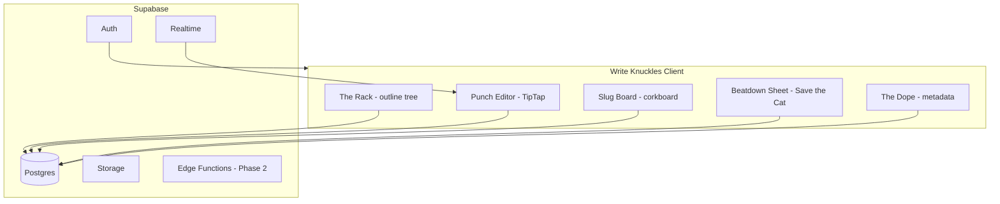
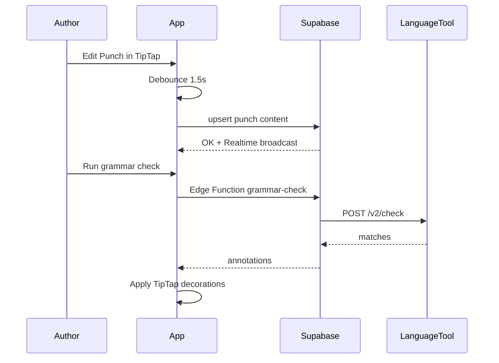

# Write Knuckles — Phase 1: Writing Mode

## Vision

**Write Knuckles** is the author’s back room for *Bronze Knuckles Magazine* — hard-hitting pulp fiction, organized like a fight card. Where Scrivener has binders and scenes, we have **The Rack**, **Hits**, and **Punches**. Where Scrivener has index cards, we have **Slugs**. Story structure isn’t abstract — it’s a **Beatdown Sheet** you can walk like Save the Cat, Hero’s Journey, or a custom pulp arc.

Phase 2 (layout/publishing) is intentionally foreshadowed in the data model but not built yet.



---

## Current Progress (as of M1 complete)

**Resume here:** M2 — TipTap editor + autosave (`rack-editor` todo)

| Area | Status | Key files |
|------|--------|-----------|
| Project scaffold | Done | [`package.json`](C:\Users\scott\Documents\code\write-knuckles\package.json), [`src/main.jsx`](C:\Users\scott\Documents\code\write-knuckles\src\main.jsx) |
| DB migration | File ready | [`supabase/migrations/001_write_knuckles_schema.sql`](C:\Users\scott\Documents\code\write-knuckles\supabase\migrations\001_write_knuckles_schema.sql) — **must be run in Supabase SQL Editor** |
| Auth + SSO | Done (code) | [`src/contexts/AuthContext.jsx`](C:\Users\scott\Documents\code\write-knuckles\src\contexts\AuthContext.jsx), [`src/lib/authStorage.js`](C:\Users\scott\Documents\code\write-knuckles\src\lib\authStorage.js); backported to [`bronze-knuckles/src/contexts/AuthContext.jsx`](C:\Users\scott\Documents\code\bronze-knuckles\src\contexts\AuthContext.jsx) |
| SSO production config | Not verified | Set `VITE_COOKIE_DOMAIN=.bronzeknucklesmagazine.com` + Supabase redirect URLs in both apps |
| Tale dashboard | Done | [`src/pages/DashboardPage.jsx`](C:\Users\scott\Documents\code\write-knuckles\src\pages\DashboardPage.jsx) |
| New Tale wizard | Done | [`src/pages/NewTalePage.jsx`](C:\Users\scott\Documents\code\write-knuckles\src\pages\NewTalePage.jsx) |
| Tale editor shell | Partial | [`src/pages/TaleEditorPage.jsx`](C:\Users\scott\Documents\code\write-knuckles\src\pages\TaleEditorPage.jsx) — Write / Slug Board / Beatdown tabs, read-only |
| TipTap editor | Not started | Placeholder in TaleEditorPage |
| Beat linking UI | Not started | Beatdown Sheet displays links but cannot create them |
| Mugshots / Joints / Dope | Not started | — |
| Grammar / export / deploy | Not started | — |

**Local setup still required:** `npm install`, copy `.env.development` from bronze-knuckles, `npm run dev` (port 5174)

---

## Repo & Stack

**Home:** [`write-knuckles`](C:\Users\scott\Documents\code\write-knuckles) — new repo, separate from the magazine site in [`bronze-knuckles`](C:\Users\scott\Documents\code\bronze-knuckles).

| Layer | Choice | Why |
|-------|--------|-----|
| Framework | React 19 + **JavaScript (JSX)** + Vite 7 | Matches magazine site stack and your familiarity |
| Routing | React Router 7 | Multi-view app shell |
| Data | **Supabase JS v2** + TanStack Query | Auth, Postgres, Realtime, future Edge Functions |
| Editor | **TipTap 2** (ProseMirror) | Extensible rich text, JSON document model, spellcheck-friendly |
| UI | Tailwind CSS 4 + **shadcn/ui** | Fast, accessible components; easy pulp theming |
| Forms/validation | React Hook Form + Zod | Beat sheets, metadata, settings |
| Drag & drop | @dnd-kit | Reorder Hits/Punches, Slug board |
| Grammar/spell | **LanguageTool Public API** (Phase 1) | Server-side keys via Edge Function; upgrade path to self-hosted LT |
| State | Zustand (UI) + TanStack Query (server) | Thin, predictable |
| Deploy | Cloudflare Pages + Supabase (same pattern as magazine) | Consistent with your existing infra |

**Magazine site reference (LIVE branch):** [`bronze-knuckles`](C:\Users\scott\Documents\code\bronze-knuckles) on branch `LIVE` — React 19 + Vite 7 + React Router 7 + Supabase JS v2.50 + SCSS. Auth and submission workflow already live.

**Stack note:** Write Knuckles stays **JavaScript throughout** — same language as the magazine. Auth pages port directly (JS + SCSS); writing cockpit uses JSX + Tailwind. No TypeScript.

**Deferred to later milestone:** AI writing insights (Edge Function + provider key), collaborative editing (Yjs), offline PWA.

---

## Pulp Domain Language

Scrivener concepts mapped to Bronze Knuckles voice:

| Scrivener | Write Knuckles | Description |
|-----------|----------------|-------------|
| Project | **Tale** | A manuscript (novel, novella, serial) |
| Binder folder | **Hit** | Major story unit (part, chapter, act block) |
| Scene | **Punch** | Atomic writing unit with body text |
| Index card | **Slug** | Corkboard card — synopsis, status, color |
| Research | **The Dope** | Notes, links, reference files |
| Characters | **Mugshots** | Character sheets |
| Locations | **Joints** | Setting sheets |
| Synopsis | **The Pitch** | Logline + back-cover copy |
| Compile | **Print Run** | Phase 2 — layout + PDF/ePub export |

Status labels on Slugs: `Raw`, `Drafted`, `Rewritten`, `Final`.

---

## Data Model (Supabase Postgres)

All tables use `uuid` PKs, `user_id` FK to `auth.users`, RLS enabled (users only see their own rows).

### Core writing

```sql
-- tales: top-level manuscript
tales (
  id, user_id, title, subtitle, genre, target_word_count,
  beat_template_id,  _progress jsonb,
  created_at, updated_at, archived_at
)

-- hits: ordered chapters/parts (tree optional via parent_id)
hits (
  id, tale_id, user_id, parent_id nullable,
  title, sort_order, synopsis,
  created_at, updated_at
)

-- punches: scenes with TipTap JSON body
punches (
  id, hit_id, tale_id, user_id,
  title, sort_order, slug_color, slug_status,
  content jsonb,           -- TipTap document
  plain_text text,          -- generated for search + word count
  word_count int,
  created_at, updated_at
)
```

### Story structure

```sql
-- beat_templates: built-in + user-custom
beat_templates (
  id, user_id nullable,     -- null = system template
  name, slug, description,
  structure jsonb           -- ordered beats with act %, guidance text
)

-- tale_beats: instantiated beatdown sheet per tale
tale_beats (
  id, tale_id, beat_template_id,
  beats jsonb,              -- copy of template + per-beat overrides
  created_at, updated_at
)

-- beat_links: connect a beat to one or more punches
beat_links (
  id, tale_id, beat_key text,  -- e.g. "save_the_cat_05"
  punch_id nullable, notes text
)
```

**Built-in templates (seed data):**
- Save the Cat (15 beats with page % guidance)
- Hero’s Journey (12 stages)
- Three-Act Pulp (custom: Hook, Complication, Gut Punch, Reversal, Knockout)
- Story Circle (Dan Harmon, 8 steps)
- Blank Beatdown Sheet

Each beat stores: `key`, `title`, `act`, `description`, `guidance` (author-facing copy in pulp voice), `target_percent`, `linked_punch_ids[]`.

### Reference & metadata

```sql
mugshots (id, tale_id, name, role, bio jsonb, avatar_url, sort_order)
joints (id, tale_id, name, description, notes jsonb, sort_order)
dope_items (id, tale_id, title, body, url, tags[], sort_order)
```

### Phase 2 hooks (schema only, no UI yet)

```sql
print_runs (
  id, tale_id, name, layout_template_id,
  settings jsonb,             -- trim size, bleed, fonts
  status, output_urls jsonb,  -- pdf, epub paths in Storage
  created_at
)
```

### Search & versioning (Phase 1 lite)

- `plain_text` on punches/updated via TipTap `onUpdate` debounce
- Postgres full-text search index on `punches.plain_text`
- Optional `punch_revisions` table (snapshot on manual "Save Snapshot" — not full auto-versioning in v1)

---

## Application Architecture

```
write-knuckles/
├── supabase/
│   ├── migrations/          # schema + RLS + seed beat templates
│   └── functions/
│       └── grammar-check/   # proxy LanguageTool, hide API key
├── src/
│   ├── app/                 # routes, providers
│   ├── components/
│   │   ├── ui/              # shadcn
│   │   ├── rack/            # outline tree
│   │   ├── editor/          # TipTap shell + toolbar
│   │   ├── slugs/           # corkboard
│   │   ├── beats/           # beatdown sheet panel
│   │   └── dope/            # research sidebar
│   ├── hooks/               # useTale, usePunch, useAutosave
│   ├── lib/
│   │   ├── supabase/
│   │   ├── editor/          # TipTap extensions config
│   │   └── beats/           # template definitions
│   ├── stores/              # UI layout, active punch, panel state
│   └── constants/           # beat template defs, slug statuses, shared enums
```

---

## UI: The Writing Cockpit

Three primary **modes** (top nav tabs, Scrivener-style):

### 1. Write Mode (default)
```
┌─────────────┬──────────────────────────┬──────────────┐
│  THE RACK   │     PUNCH EDITOR         │  INSPECTOR   │
│  (tree)     │     TipTap + toolbar     │  Slug card   │
│  Hits ▾     │                          │  Beat link   │
│   Punches   │                          │  Word count  │
│             │                          │  Mugshot refs│
└─────────────┴──────────────────────────┴──────────────┘
```

- **The Rack:** collapsible tree, drag-reorder Hits/Punches, right-click context (new Hit, new Punch, duplicate, archive)
- **Punch Editor:** distraction-free prose mode toggle; typewriter scroll; session word count
- **Inspector:** slug synopsis, status color, POV, linked Mugshots/Joints, linked Beat

### 2. Slug Board
Corkboard grid of Slugs (one per Punch). Drag between Hits. Color = status. Double-click opens Punch in Write Mode.

### 3. Beatdown Sheet
Vertical timeline of beats from selected template. Each row shows:
- Beat title + pulp guidance blurb
- Target % / word-count milestone (computed from tale target)
- Linked Punch chips (click to jump)
- Progress indicator (empty / linked / drafted)

Selecting Save the Cat on a new Tale pre-populates all 15 beats with guidance copy written in Bronze Knuckles voice.

---

## Editor (TipTap)

**Extensions (Phase 1):**
- StarterKit (headings limited to H2/H3 for structure within a Punch)
- Placeholder, CharacterCount, Typography
- Highlight (for notes-to-self)
- Link, Blockquote
- **GrammarHighlight** (custom decoration from LanguageTool results)

**Toolbar:** bold, italic, underline, highlight, blockquote, undo/redo, focus mode, grammar check toggle.

**Autosave:** debounced 1.5s → upsert `punches.content` + regenerate `plain_text` + `word_count`. Optimistic UI with TanStack Query mutation. Toast on save error only.

**Grammar/spell flow:**
1. User triggers check (manual button or on idle after 3s pause)
2. Client calls Supabase Edge Function `grammar-check` with plain text excerpt
3. Function calls LanguageTool API, returns `{ offset, length, message, replacements[] }`
4. TipTap decorations underline issues; click for suggestions

No AI insights in Phase 1 — but Inspector includes **Readability Stats** (Flesch-Kincaid, avg sentence length, adverb count via local heuristics) as a free "writing pulse" until AI lands.

---

---

## Magazine Site Integration (LIVE Branch)

The [`bronze-knuckles`](C:\Users\scott\Documents\code\bronze-knuckles) `LIVE` branch is the source of truth for shared auth and branding.

### Existing Supabase project

Same project for magazine + Write Knuckles (already in [`.env.development`](C:\Users\scott\Documents\code\bronze-knuckles\.env.development)):
- Project ref: `rjquutusbwfrfpbwrxxd`
- Auth emails via **Resend** (already configured — no new subscription)
- No migrations in repo; schema managed in Supabase dashboard

### Existing tables (magazine — do not touch)

| Table | Purpose |
|-------|---------|
| `Admins` | Admin role lookup by `admin_id` |
| `Contributors` | Submission contributor profiles |
| `Submissions` | Story submissions to the magazine |
| `Texts` | Submission body text |

Write Knuckles gets **new tables** (`tales`, `hits`, `punches`, etc.) in the same project. RLS keeps magazine data and writing data isolated per user.

### Auth files to port (copy verbatim, then env-tweak)

```
bronze-knuckles/src/
├── clients/supabase.js
├── contexts/AuthContext.jsx          ← needs redirect URL + session fixes (below)
├── pages/SigninPage.jsx + .scss      ← combined sign-in + sign-up form
├── pages/ResetPage.jsx + .scss
├── components/ProtectedRoute.jsx
├── components/Input.jsx + .scss
├── components/Button.jsx + .scss
├── components/Password.jsx + .scss
└── components/Divider.jsx + .scss
public/whosthere.jpg                   ← sign-in hero image
```

[`SigninPage.jsx`](C:\Users\scott\Documents\code\bronze-knuckles\src\pages\SigninPage.jsx) is a single page with email + password fields and both **Sign Up** and **Sign In** buttons — not separate forms. Post-signup shows email confirmation notice. [`AuthContext.jsx`](C:\Users\scott\Documents\code\bronze-knuckles\src\contexts\AuthContext.jsx) handles `signUp`, `signIn`, `signOut`, admin check against `Admins` table.

### Required auth tweaks when porting

1. **Env-driven redirect URLs** — magazine hardcodes `https://bronzeknucklesmagazine.com/signin` and `/reset?mode=reset`. Replace with `import.meta.env.VITE_APP_URL` so Write Knuckles uses its own domain.
2. **Single sign-on (SSO) across subdomains** — **M1 success criterion.** One login on either site keeps the user signed in on both `bronzeknucklesmagazine.com` and `write.bronzeknucklesmagazine.com`. Today the magazine stores session in `sessionStorage` key `bk-session`, which is origin-scoped and blocks SSO. Fix in **both repos**:
   - Remove manual `sessionStorage` session management from `AuthContext`
   - Use Supabase client's built-in session persistence (`onAuthStateChange` + `getSession`)
   - Configure Supabase Auth cookie domain to `.bronzeknucklesmagazine.com` (Supabase dashboard → Auth → URL Configuration)
   - Verify: sign in on magazine → open Write Knuckles → already authenticated (and vice versa)
3. **Supabase redirect URLs** — add Write Knuckles URLs to Auth settings alongside existing magazine URLs.
4. **Post-login redirect** — magazine navigates to `/submissions`; Write Knuckles navigates to `/` (Tale dashboard).

---

## Auth & Onboarding

**Shared auth with the magazine site** — port the existing sign-in/sign-up page from the `LIVE` branch, pointed at the **same Supabase project**.

| Capability | Phase 1 target |
|------------|----------------|
| **One account** | Sign up once; same email/password on magazine and Write Knuckles |
| **Single sign-on (SSO)** | Sign in once on either site; session persists on both subdomains (M1 deliverable) |
| **Shared password reset** | Reset flow works for both apps via same Supabase Auth + Resend emails |

Implementation approach:
- Copy auth module files listed above into `write-knuckles/src/` (same paths)
- Share `VITE_SUPABASE_URL` and `VITE_SUPABASE_ANON_KEY` (same values as magazine)
- Add `VITE_APP_URL` for Write Knuckles redirect URLs
- **Backport SSO fix to [`bronze-knuckles` LIVE branch](C:\Users\scott\Documents\code\bronze-knuckles)** — both apps must use the same session strategy
- Routes: `/signin`, `/reset` (ported); protected routes wrap Tale dashboard and editor

- Supabase Auth: email/password (same as magazine); email confirmation via Resend
- First login → **New Tale wizard:**
  1. Title + genre
  2. Pick beat template (Save the Cat recommended for pulp)
  3. Set target word count
  4. Creates default Hit ("Act I") + first empty Punch ("Opening Punch")

Dashboard (`/`) lists Tales with word count progress bar and last edited timestamp.

---

## Brand & Design System

**Aesthetic:** Extend the magazine's existing pulp palette into a writing-focused dark UI. Auth pages keep magazine styling exactly; the writing cockpit goes darker and more immersive.

### Magazine tokens (inherit on auth pages)

From [`index.css`](C:\Users\scott\Documents\code\bronze-knuckles\src\index.css):

| Token | Value | Use |
|-------|-------|-----|
| `--main-color` | `#938938` | Bronze/gold accent — buttons, headers, credits |
| `--main-back-subtle` | `#5e5e5e` | Subtle backgrounds |
| `--main-error` | `#dd7c7c` | Error messages |
| Button border | `#726a2b` | `.bk-button` hover → `--main-color` |

### Writing cockpit tokens (Write Knuckles app shell)

| Token | Value |
|-------|-------|
| Background | `#1a1410` (ink black) |
| Surface | `#2a2218` (weathered paper dark) |
| Accent | `#938938` (match magazine bronze) |
| Punch red | `#8b2635` (blood slug) |
| Text | `#e8dcc8` (newsprint cream) |
| Writing font | **Courier Prime** or **Literata** |
| UI font | **Oswald** or **Bebas Neue** (condensed pulp headlines) |

Micro-copy examples:
- Empty state: *"No punches thrown yet. Step into the ring."*
- Save indicator: *"Locked in."*
- Beat guidance header: *"The Setup — before the fist flies"*

Logo: knuckled fist + typewriter key (reuse/adapt from magazine brand when available).

---

## Key User Flows



---

## Phase 1 Milestones (Build Order)

### M1 — Foundation (Week 1) — COMPLETE
- [x] Scaffold `write-knuckles`: Vite + React + JavaScript + Tailwind
- [x] Link to existing Supabase project (`rjquutusbwfrfpbwrxxd`); migration file + RLS written
- [x] Port auth module from [`bronze-knuckles` LIVE branch](C:\Users\scott\Documents\code\bronze-knuckles); env-driven redirect URLs
- [x] Cross-subdomain SSO code in both write-knuckles and bronze-knuckles (`authStorage.js` + `onAuthStateChange`)
- [ ] Verify SSO in production (cookie domain + Supabase redirect URLs)
- [x] Tale CRUD + dashboard + New Tale wizard
- [x] Tale editor shell (three-mode tabs, read-only Rack / Slug Board / Beatdown Sheet)

### M2 — The Rack + Punches (Week 2) — IN PROGRESS
- [x] Hit/Punch tree display (read-only, no drag-reorder)
- [ ] TipTap editor wired to Punch
- [ ] Autosave + word count
- [ ] Editable Inspector (title, synopsis, status, color)
- [ ] Rack drag-reorder + create/delete Hits/Punches

### M3 — Slug Board + Beatdown Sheet (Week 3) — PARTIAL
- [x] Corkboard view (read-only slug cards)
- [x] Seed beat templates; Tale wizard with template picker
- [x] Beatdown Sheet UI (read-only beat timeline + linked punch chips)
- [ ] Beat linking UI (connect beats to punches)
- [ ] Slug editing (synopsis, status, color)
- [ ] Corkboard drag between Hits
- [ ] Progress tracking (% beats linked + drafted)

### M4 — The Dope + Mugshots + Joints (Week 4)
- Reference panels (Mugshots, locations, research notes)
- Link Mugshots/Joints to Punches in Inspector
- Full-text search across Punches

### M5 — Grammar + Polish (Week 5)
- LanguageTool Edge Function
- Grammar highlights in editor
- Readability stats (local)
- Export: **Markdown + plain text** per Tale or selected Punches (DOCX optional stretch)
- Pulp theming pass, responsive layout, empty states
- Cloudflare Pages deploy

---

## Phase 2 Foreshadow (Do Not Build Yet)

Design Phase 1 so these drop in cleanly:

- `punches.content` JSON → layout engine input (Phase 2 Scribus-like canvas)
- `print_runs` table + Storage bucket for PDF/ePub
- `tales` metadata → magazine issue assignment (link to bronze-knuckles site)
- Edge Function slot for AI insights (beat completion suggestions, tone check, cliché flagging)
- Typography/style tokens on Tale → inherited by layout templates

---

## Security & RLS

Every table: `user_id = auth.uid()` for SELECT/INSERT/UPDATE/DELETE. Edge Function validates JWT before LanguageTool call. No client-side API keys. Storage buckets (future) scoped per user.

---

## Success Criteria for Phase 1

- [ ] **Single sign-on works** in production (code done; production config not verified)
- [x] Author can sign up and create a Tale with Save the Cat beats via New Tale wizard
- [ ] Author can organize Hits/Punches with drag-reorder
- [ ] Author can write in a rich-text editor with autosave
- [x] Slug Board and Beatdown Sheet views exist (read-only shell)
- [ ] Beat linking and slug editing functional
- [ ] Grammar/spell check works on demand
- [ ] Word counts, beat progress, and readability stats visible
- [ ] Markdown export works
- [ ] Deployed to production URL, Supabase backing live data

This is the back room where pulp gets written. Phase 2 is where it gets printed.

---

## Cost & Subscriptions

**Short answer: Phase 1 can run entirely on free tiers. Nothing beyond Supabase is required to pay for.**

| Service | Phase 1 cost | Notes |
|---------|--------------|-------|
| **Supabase** | Free tier works to start; Pro ~$25/mo when you outgrow it | Auth, Postgres, Realtime, Edge Functions all included. **Same project as magazine** — no second Supabase bill |
| **Cloudflare Pages** | **Free** | Hosting for the React app; unlimited bandwidth on free plan |
| **Resend** | **Free** | Already used by magazine for signup confirmation + password reset emails — Write Knuckles reuses same Supabase Auth email config |
| **LanguageTool** | **Free** (public API) | Free public endpoint with rate limits (~20 req/min per IP). Edge Function proxies requests so limits are manageable for personal use. Premium API (~€4.99/mo+) only needed at scale or for higher rate limits |
| **TipTap, React, shadcn, etc.** | **Free** | All open-source MIT/Apache libraries in the planned stack |
| **Google Fonts** | **Free** | Courier Prime, Oswald, etc. |
| **AI insights (deferred)** | Pay-as-you-go when added | OpenAI/Anthropic API keys — only when you opt in later; not Phase 1 |

**Optional paid upgrades down the road (not required):**
- Supabase Pro when DB size, auth MAU, or Edge Function volume grows
- LanguageTool Premium API or self-hosted LanguageTool on a cheap VPS (~$5/mo) if grammar-check volume becomes heavy
- Custom domain DNS — you likely already have this for the magazine
- TipTap Pro extensions — only if you want their commercial collaboration/AI extensions; not needed for Phase 1

**Self-host alternative for grammar:** LanguageTool is open source. You can run it yourself later (Docker on a $5 VPS) and pay nothing per request — the Edge Function would point at your instance instead of the public API.
